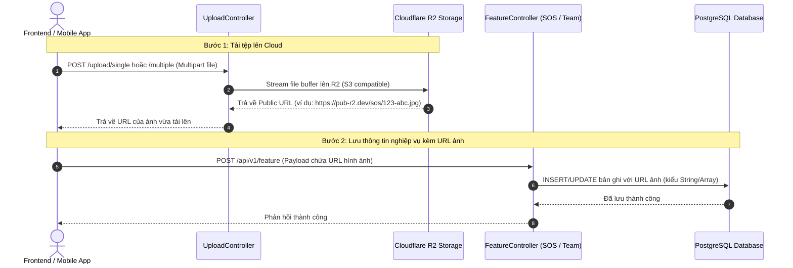

# 📘 Phân tích thiết kế hệ thống lưu trữ hình ảnh (Media Storage Analysis)

Tài liệu này phân tích chi tiết về kiến trúc hiện tại, các vấn đề liên quan đến việc lưu trữ hình ảnh cho các module `SosRequest` (Yêu cầu SOS) và `RescueTeam` (Đội cứu hộ), đồng thời đề xuất giải pháp thiết kế tối ưu và các bước triển khai cụ thể.

---

## 1. Kiến trúc lưu trữ Media hiện tại

Hệ thống của chúng ta áp dụng mô hình **Direct Cloud Storage (lưu trữ trực tiếp lên Cloudflare R2)** và **Database URLs reference (lưu đường dẫn ảnh vào Database)**.

### Luồng hoạt động:


### Ưu điểm của kiến trúc này:
1. **Không phụ thuộc vào ổ đĩa local của server:** Tránh quá tải dung lượng và bộ nhớ trên server NestJS.
2. **Tốc độ phản hồi cao:** Việc tải và hiển thị ảnh được đẩy sang CDN của Cloudflare R2, NestJS API chỉ chịu trách nhiệm quản lý nghiệp vụ và lưu trữ URL chuỗi gọn nhẹ.
3. **Bảo mật:** Dễ dàng kiểm soát định dạng, dung lượng tệp (`FileFilterOptions`) trước khi lưu.

---

## 2. Phân tích hiện trạng từng Module

### 2.1 Module Yêu cầu SOS (SOS Request)

#### A. Khảo sát hiện trạng:
- Trong Database Entity ([sos-request.entity.ts](file:///d:/DoAn/DOAN/be/src/infrastructure/database/entities/sos-request.entity.ts)), cột `imageUrls` đang được định nghĩa là:
  ```typescript
  @Column({ type: 'varchar', array: true })
  imageUrls: string;
  ```
  *Lưu ý: Có sự không đồng nhất về kiểu dữ liệu (TypeScript type là `string` nhưng TypeORM `@Column` khai báo `array: true` lưu dạng mảng).*
- Trong Domain Entity ([sos-request.entity.ts](file:///d:/DoAn/DOAN/be/src/modules/sos-request/domain/entities/sos-request.entity.ts)), kiểu dữ liệu là:
  ```typescript
  imageUrls: string[] | string;
  ```
- Trong nghiệp vụ của Service ([sos-request.service.ts](file:///d:/DoAn/DOAN/be/src/modules/sos-request/application/services/sos-request.service.ts)), hệ thống đã áp dụng quy tắc:
  - Khách vãng lai gửi SOS **bắt buộc phải có ít nhất 1 ảnh hiện trường** thực tế (`imageUrls` không được rỗng).
  - Dữ liệu `imageUrls` được gửi lên dạng mảng các chuỗi URL (lấy từ API Upload trước đó).

#### B. Vấn đề cần khắc phục:
1. **Kiểu dữ liệu TypeScript của Database Entity chưa đồng bộ:** Cần sửa `imageUrls: string` thành `imageUrls: string[]` để đồng bộ đúng với định dạng mảng chuỗi trong PostgreSQL (`varchar[]`).
2. **Xác nhận cấu trúc dữ liệu gửi từ Frontend:** Phải thống nhất dạng JSON payload luôn là `string[]` khi gửi lên API `POST /sos-requests`.

---
OK => tôi đồng ý việc này
### 2.2 Module Đội Cứu Hộ (Rescue Team)

#### A. Khảo sát hiện trạng:
- Hiện tại, thực thể `RescueTeamEntity` và interface domain `RescueTeam` **chưa có bất kỳ thuộc tính nào để lưu trữ hình ảnh** (ví dụ: Logo đội, Ảnh đại diện, Ảnh các hoạt động/trang thiết bị cứu hộ).
- Điều này khiến giao diện Frontend không thể hiển thị hình ảnh đặc trưng hay logo riêng của từng đội cứu hộ (như đội PCCC, Đội y tế, Đội tình nguyện viên tự phát).

#### B. Thiết kế và Nghiệp vụ Logo cho Rescue Team (Điều chỉnh theo yêu cầu):
- **Logo của nhóm không bắt buộc phải tải lên (Không cần thiết bắt buộc):** Người dùng khi tạo đội cứu hộ không bắt buộc phải upload logo riêng.
- **Sử dụng ảnh Logo mặc định từ Environment Variables:** Hệ thống sẽ tự động gán hoặc hiển thị bằng một ảnh mặc định được cấu hình trong file `.env` nếu đội đó không có logo riêng.
- **Cơ chế fallback:**
  - Nếu `logoUrl` trong Database là `null` hoặc rỗng → Trả về đường dẫn ảnh logo mặc định lấy từ biến môi trường.
  - Cấu hình logo mặc định động dựa theo loại hình đội cứu hộ (`TeamType`) lấy từ `.env`, ví dụ:
    - `DEFAULT_LOGO_PCCC` -> Logo mặc định cho đội PCCC.
    - `DEFAULT_LOGO_YTE` -> Logo mặc định cho đội Y Tế.
    - `DEFAULT_LOGO_VOLUNTEER` -> Logo mặc định cho đội Tình Nguyện.
    - `DEFAULT_LOGO_GENERAL` -> Logo mặc định chung cho các loại đội khác.

---

## 3. Giải pháp thiết kế đề xuất

Chúng tôi đề xuất tích hợp lưu trữ hình ảnh theo phương pháp **Column-based URL (lưu trực tiếp URL dạng cột)** vì nó đơn giản, hiệu năng cao và phù hợp nhất với cấu trúc cơ sở dữ liệu hiện tại của hệ thống.

### 3.1 Cải tiến Module Đội cứu hộ (Rescue Team)
Thêm trường `logoUrl` để lưu ảnh đại diện/logo đội.

#### Thay đổi Database Schema:
- Thêm cột `logo_url` kiểu `VARCHAR(500)` (nullable) vào bảng `rescue_team`.

#### Thay đổi Mã nguồn & Logic Mặc định:
1. **Database Entity (`RescueTeamEntity`):**
   ```typescript
   @Column({ type: 'varchar', length: 500, nullable: true })
   logoUrl?: string | null;
   ```
2. **Domain Entity (`RescueTeam`):**
   ```typescript
   logoUrl?: string | null;
   ```
3. **DTOs & Logic nghiệp vụ (Fallback):**
   - DTO nhận `logoUrl` là trường tùy chọn (optional).
   - Ở tầng DTO mapper/Response mapping hoặc Service, chúng ta tiêm `ConfigService` để lấy các URL mặc định từ `.env`:
     ```typescript
     // Logic lấy Logo qua ConfigService
     const pcccLogo = this.configService.get<string>('DEFAULT_LOGO_PCCC');
     const yteLogo = this.configService.get<string>('DEFAULT_LOGO_YTE');
     const volunteerLogo = this.configService.get<string>('DEFAULT_LOGO_VOLUNTEER');
     const generalLogo = this.configService.get<string>('DEFAULT_LOGO_GENERAL');

     const teamLogo = team.logoUrl || (
       team.teamType === TeamType.PCCC ? pcccLogo :
       team.teamType === TeamType.Y_TE ? yteLogo :
       (team.teamType === TeamType.VOLUNTEER || team.teamType === TeamType.VOLUNTEER_SPONTANEOUS) ? volunteerLogo :
       generalLogo
     );
     ```

---

### 3.2 Chuẩn hóa Module Yêu cầu SOS (SOS Request)
Sửa lỗi bất đồng bộ kiểu dữ liệu mảng hình ảnh.

#### Thay đổi Database Entity (`SosRequestEntity`):
```typescript
@Column({ type: 'varchar', array: true, nullable: true })
imageUrls: string[];
```
*(Đảm bảo TypeScript hiểu đây là mảng `string[]` thay vì một chuỗi đơn lẻ).*

---

## 4. Quy trình vận hành & Sử dụng API từ Client (Frontend)

Quy trình sử dụng ảnh cho cả 2 module sẽ diễn ra qua **2 bước độc lập**:

```
[Màn hình gửi SOS / Tạo Đội]
       │
       ▼
1. Người dùng chọn ảnh từ thiết bị
       │
       ▼
2. Gọi API Upload:
   POST /upload/single?folder=rescue-teams (đối với Đội cứu hộ)
   HOẶC
   POST /upload/multiple?folder=sos (đối với Yêu cầu SOS)
       │
       ▼
3. Nhận về URL ảnh (ví dụ: "https://pub-r2.dev/sos/1718234567.jpg")
       │
       ▼
4. Gửi payload dữ liệu kèm URL ảnh lên API nghiệp vụ:
   POST /sos-requests  => payload: { ..., imageUrls: ["url1", "url2"] }
   POST /rescue-teams  => payload: { ..., logoUrl: "url" } (hoặc để trống để dùng ảnh mặc định)
```

---

## 5. Kế hoạch triển khai cụ thể (Action Plan)

| Bước | Layer bị ảnh hưởng | File cần chỉnh sửa | Nội dung chỉnh sửa |
| :--- | :--- | :--- | :--- |
| **1** | Database (Entity) | [rescue-team.entity.ts](file:///d:/DoAn/DOAN/be/src/infrastructure/database/entities/rescue-team.entity.ts) | Thêm trường `@Column() logoUrl` |
| **2** | Database (Entity) | [sos-request.entity.ts](file:///d:/DoAn/DOAN/be/src/infrastructure/database/entities/sos-request.entity.ts) | Sửa kiểu dữ liệu `imageUrls` thành `string[]` |
| **3** | Domain (Entity) | [rescue-team.ts](file:///d:/DoAn/DOAN/be/src/modules/rescue-team/domain/entities/rescue-team.ts) | Thêm `logoUrl?: string \| null` vào interface `RescueTeam` |
| **4** | Application (DTO) | DTOs của `rescue-team` | Thêm `logoUrl` vào `CreateRescueTeamDto`, `UpdateRescueTeamDto`, `RescueTeamResponseDto` |
| **5** | Presentation (Controller) | Controller của `rescue-team` | Đảm bảo chuyển giao trường `logoUrl` từ DTO vào Service, áp dụng cơ chế logo mặc định khi trả về phản hồi |
| **6** | Database Migration | PostgreSQL | Chạy Prisma hoặc TypeORM migration để đồng bộ cơ sở dữ liệu thực tế (Thêm cột `logo_url` và đảm bảo kiểu dữ liệu `image_urls` là array) |