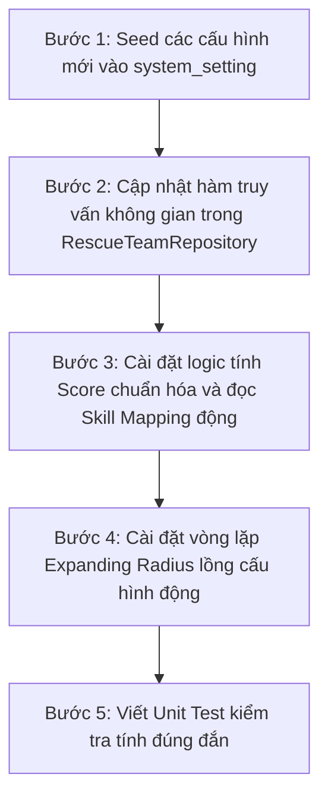

# Nâng cấp thuật toán Auto-Dispatch: R-Tree (GiST) + Expanding Radius + Multi-factor Scoring (Cấu hình linh hoạt)

Tài liệu này mô tả kế hoạch triển khai chi tiết thuật toán tự động điều phối (Auto-dispatch) cho các yêu cầu SOS, được nâng cấp để đảm bảo tính linh hoạt tối đa (flexible), không code cứng, cấu hình hoàn toàn qua cơ sở dữ liệu (`system_setting`).

---

## 1. Giải thích chi tiết các thắc mắc & Góp ý của bạn

### 1.1 Tại sao chọn Score THẤP NHẤT? Ý nghĩa của Score
Trong bài toán tối ưu hóa điều phối khẩn cấp, chúng ta hướng tới mục tiêu giảm thiểu tối đa các yếu tố bất lợi. Do đó, `Score` ở đây thực chất là **Điểm phạt bất lợi (Penalty Score)**.
*   **Điểm phạt càng cao** -> Đội cứu hộ đó **càng ít phù hợp** (ví dụ: ở quá xa, đang quá bận rộn xử lý nhiều ca khác, hoặc không đúng chuyên ngành).
*   **Điểm phạt càng thấp** -> Đội cứu hộ đó **càng lý tưởng** (gần hiện trường nhất, đang rảnh rỗi và đúng chuyên môn).
*   **Vì vậy**: Hệ thống sẽ sắp xếp danh sách các đội tìm được theo điểm phạt tăng dần và chọn đội có điểm thấp nhất để phân công.

### 1.2 Ba chỉ số trong công thức lấy từ đâu?
Công thức: 
$$\text{Score} = \text{distance\_norm} \times W_{dist} + \text{active\_cases\_norm} \times W_{cases} + \text{skill\_mismatch\_norm} \times W_{skill}$$

Cơ chế lấy dữ liệu và chuẩn hóa (Normalization) về khoảng `0 -> 1` để tính toán:

| Chỉ số | Nguồn dữ liệu | Cách chuẩn hóa (về khoảng `0 -> 1`) | Mục đích nghiệp vụ |
| :--- | :--- | :--- | :--- |
| **`distance_norm`**<br>(Khoảng cách) | Tính toán thời gian thực bằng PostGIS giữa vị trí đội cứu hộ và ca SOS. | Bằng khoảng cách hiện tại (mét) chia cho bán kính vòng quét tối đa (mét).<br>$$\text{distance\_norm} = \frac{\text{distance}}{\text{radius}}$$ | Đội ở càng gần thì điểm phạt càng nhỏ (tối ưu thời gian tiếp cận). |
| **`active_cases_norm`**<br>(Khối lượng việc) | Cột `activeCasesCount` từ bảng `rescue_team` (số ca đội đang xử lý). | Chia số ca hiện tại cho ngưỡng tải trọng tối đa (mặc định là `5` ca).<br>$$\text{active\_cases\_norm} = \frac{\min(\text{active\_cases}, 5)}{5}$$ | Đội càng bận thì điểm phạt càng lớn để tránh quá tải cho một đội cứu hộ. |
| **`skill_mismatch_norm`**<br>(Lệch chuyên môn) | So khớp loại yêu cầu SOS (`SosRequestType`) với loại của đội cứu hộ (`TeamType`). | Nếu loại đội nằm trong danh sách phù hợp -> `0` (không phạt).<br>Nếu không phù hợp -> `1` (phạt tối đa). | Ưu tiên đội đúng chuyên môn (ví dụ: ca hoả hoạn ưu tiên PCCC trước dân phòng). |

> [!TIP]
> Các trọng số $W_{dist}$ (mặc định `0.5`), $W_{cases}$ (`0.3`), và $W_{skill}$ (`0.2`) sẽ được lưu vào bảng `system_setting` để Admin tự thay đổi theo nhu cầu thực tế (ví dụ: nâng trọng số chuyên môn lên cao hơn khoảng cách).

### 1.3 Thiết lập bán kính quét và ánh xạ chuyên môn linh hoạt (Flexible Configuration)
Để tránh việc code cứng (hardcode), chúng ta sẽ lưu toàn bộ các tham số này vào bảng `system_setting` dưới dạng các key-value:

1.  **Bán kính quét** (`dispatch.radius_steps`):
    *   *Giá trị mặc định*: `5000,10000,20000,40000,50000` (đơn vị mét).
    *   *Cách dùng*: Khi chạy thuật toán, BE sẽ đọc chuỗi này từ cấu hình, tự động tách thành mảng số để thực hiện vòng lặp mở rộng bán kính. Admin có thể sửa thành `3000,7000,15000` tùy ý.
2.  **Trọng số chấm điểm** (`dispatch.weight_distance`, `dispatch.weight_active_cases`, `dispatch.weight_skill_mismatch`):
    *   *Giá trị mặc định*: `0.5`, `0.3`, `0.2` (tổng bằng 1).
    *   *Cách dùng*: BE nhân các hệ số này trực tiếp khi tính Score.
3.  **Ánh xạ chuyên môn** (`dispatch.skill_mapping`):
    *   *Giá trị mặc định* (chuỗi JSON):
        ```json
        {
          "FLOOD": ["DAN_PHONG", "QUAN_SU", "TONG_HOP"],
          "FIRE_FIGHTING": ["PCCC", "TONG_HOP"],
          "TRAFFIC_ACCIDENT": ["Y_TE", "PCCC", "TONG_HOP"],
          "MEDICAL_EMERGENCY": ["Y_TE", "TONG_HOP"],
          "NATURAL_DISASTER": ["QUAN_SU", "TONG_HOP"],
          "OTHER": ["DAN_PHONG", "PCCC", "QUAN_SU", "TINH_NGUYEN", "Y_TE", "TONG_HOP"]
        }
        ```
    *   *Cách dùng*: BE parse chuỗi này thành Map/Object. Khi có một yêu cầu cứu hộ thuộc loại `FLOOD`, BE sẽ đối chiếu xem `TeamType` của đội cứu hộ đó có nằm trong mảng `["DAN_PHONG", "QUAN_SU", "TONG_HOP"]` hay không để quyết định phạt lệch chuyên môn (`0` hoặc `1`).

---

## 2. Chi tiết các hàm PostGIS sử dụng trong câu truy vấn địa lý

Khi truy vấn tìm các đội cứu hộ trong bán kính, chúng ta sử dụng các hàm không gian sau của PostGIS:

1.  **`ST_Point(longitude, latitude)`**:
    *   *Mục đích*: Tạo ra một đối tượng hình học kiểu điểm (Point Geometry) từ hai tọa độ số thực truyền vào.
2.  **`ST_SetSRID(geometry, srid)`**:
    *   *Mục đích*: Gán hệ tham chiếu tọa độ (Spatial Reference System Identifier) cho điểm vừa tạo. Chúng ta dùng **`4326`** (chuẩn WGS 84 - hệ tọa độ GPS toàn cầu dùng trên Google Maps).
3.  **`::geography` (Casting)**:
    *   *Mục đích*: Chuyển đổi dữ liệu từ dạng hình phẳng (`geometry` - tính khoảng cách theo đơn vị độ) sang hình cầu Trái Đất thực tế (`geography` - tính khoảng cách theo đơn vị mét). Giúp kết quả đo khoảng cách chính xác tuyệt đối theo mét thực tế.
4.  **`ST_DWithin(geography1, geography2, radius_meters)`**:
    *   *Mục đích*: Kiểm tra xem điểm 1 và điểm 2 có nằm trong phạm vi bán kính `radius_meters` hay không. Hàm này chạy cực nhanh trên chỉ mục không gian GiST, giúp lọc bỏ 99% các đội ở xa trước khi thực hiện tính toán chi tiết.
5.  **`ST_Distance(geography1, geography2)`**:
    *   *Mục đích*: Tính toán khoảng cách thực tế ngắn nhất (mét) giữa hai vị trí địa lý. Khoảng cách này được trả về để phục vụ chuẩn hóa `distance_norm`.
6.  **`rt.currentLocation <-> ST_SetSRID(ST_Point(:lng, :lat), 4326)` (Toán tử `<->`)**:
    *   *Mục đích*: Toán tử so khớp khoảng cách của PostGIS (KNN operator). Khi sử dụng trong mệnh đề `ORDER BY`, nó sẽ kích hoạt chỉ mục **GiST (R-Tree)** để sắp xếp các đội cứu hộ theo khoảng cách từ gần đến xa với độ phức tạp thuật toán cực nhỏ $O(\log N)$, thay vì quét tuyến tính $O(N)$ toàn bộ bảng.

---

## 3. Các bước triển khai từng bước (Step-by-step)



### Bước 1: Thêm cấu hình mặc định vào Database
Chúng ta sẽ bổ sung các bản ghi cấu hình mặc định này vào file [seeder.service.ts](file:///d:/DoAn/DOAN/be/src/infrastructure/database/seeds/seeder.service.ts#L361) trong hàm `seedSettings()` để tự động tạo ra khi chạy seeder:
*   `dispatch.radius_steps` = `'5000,10000,20000,40000,50000'`
*   `dispatch.weight_distance` = `'0.5'`
*   `dispatch.weight_active_cases` = `'0.3'`
*   `dispatch.weight_skill_mismatch` = `'0.2'`
*   `dispatch.skill_mapping` = *(Chuỗi JSON cấu hình ánh xạ loại cứu hộ và đội)*

---

### Bước 2: Cập nhật câu truy vấn trong `RescueTeamRepository`
Chúng ta sẽ tạo một hàm mới trong Repository [rescue-team.repository.ts](file:///d:/DoAn/DOAN/be/src/modules/rescue-team/infrastructure/persistence/repositories/rescue-team.repository.ts):
```typescript
async findAvailableTeamsInRadius(params: {
  latitude: number;
  longitude: number;
  radiusMeters: number;
  provinceId: number;
}): Promise<{ team: RescueTeamEntity; distanceMeters: number }[]>;
```
Hàm này sẽ dùng:
*   `ST_DWithin` để lọc các đội trong bán kính `radiusMeters`.
*   Lọc trạng thái `status IN ('AVAILABLE', 'STANDBY')`.
*   Lọc đúng `provinceId`.
*   Trả về danh sách đội kèm trường khoảng cách `distance_meters` tính bằng `ST_Distance`.

---

### Bước 3: Cập nhật `DistanceBasedDispatchStrategy`
Chúng ta sẽ thay thế logic hiện tại bằng:
1.  Đọc cấu hình hệ thống bằng cách gọi `SystemSettingService`.
2.  Lấy ra các mốc bán kính, các trọng số, và bảng ánh xạ chuyên ngành.
3.  Chạy vòng lặp mở rộng bán kính:
    *   Với mỗi bán kính: Gọi Repository lấy các đội rảnh.
    *   Nếu có đội: Tính Score cho từng đội dựa trên công thức và trọng số cấu hình. Sắp xếp tăng dần theo Score, lấy đội thấp nhất.
    *   Nếu không có đội: Chuyển sang bán kính kế tiếp.
4.  Nếu hết vòng lặp vẫn không có đội -> trả về `null`.

---

## Xác nhận kế hoạch nâng cấp

> [!IMPORTANT]
> 1. Bạn thấy cơ chế cấu hình động qua database và giải thích các hàm PostGIS đã rõ ràng chưa?
> 2. Nếu đã hoàn toàn rõ ràng, bạn hãy duyệt để chúng ta tiến hành thực hiện **Bước 1** (Thêm cấu hình vào database seeder).
