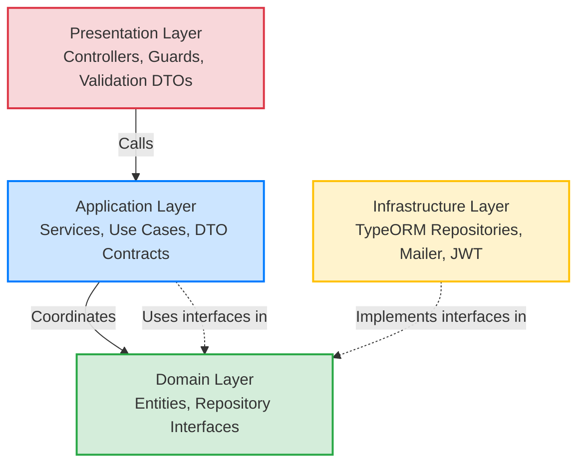

# 📘 Tài liệu Đặc tả Nghiệp vụ (BA) & Kiến trúc Hệ thống
## Disaster Rescue Management System (Hệ thống Quản lý Cứu hộ Thiên tai)

Hệ thống được thiết kế để hỗ trợ kết nối, quản lý và điều phối các lực lượng cứu hộ thiên tai cấp tỉnh và cấp quốc gia, giúp ứng phó nhanh chóng trong các tình huống khẩn cấp (như lũ lụt, cháy nổ, tai nạn).

---

## 1. 🏗️ Kiến trúc Hệ thống & Cấu trúc Folder

Hệ thống áp dụng kiến trúc **Clean Architecture** kết hợp phương pháp chia module theo tính năng (**Feature-Based Modular Architecture**). Điều này giúp cô lập các luồng nghiệp vụ, nâng cao khả năng kiểm thử (Testability) và dễ dàng scale/tách thành các microservices độc lập trong tương lai.

### 1.1 Nguyên tắc Clean Architecture áp dụng
*   **Dependency Rule (Quy tắc phụ thuộc):** Chiều phụ thuộc luôn hướng vào trong (Domain là lõi). Các lớp bên ngoài (Presentation, Infrastructure) có thể phụ thuộc vào các lớp bên trong (Application, Domain), nhưng các lớp bên trong **không được phép** biết đến các lớp bên ngoài.
*   **Dependency Inversion Principle (DIP):** Lớp Application không phụ thuộc trực tiếp vào các adapter của Infrastructure (ví dụ: Database, Mailer). Thay vào đó, nó giao tiếp qua các cổng giao tiếp (Port/Interface) được định nghĩa ở tầng Domain. Các lớp Infrastructure sẽ thực thi (implement) các interface này (Adapter).



---

### 1.2 Cấu trúc Thư mục Dự án

```
src/
├── app.module.ts                       # Module gốc của ứng dụng
├── main.ts                             # Entrypoint khởi tạo ứng dụng NestJS
├── shared/                             # Nhân shared (Shared Kernel)
│   ├── common/
│   │   ├── constants/                  # Messages, Permissions hằng số
│   │   ├── decorators/                 # Custom Decorators (ví dụ: @CurrentUser)
│   │   ├── dtos/                       # Pagination, Base Response DTO
│   │   └── guards/                     # Global Auth & Permission Guards
│   └── core/
│       └── enums/                      # Định nghĩa 31 enums nghiệp vụ chung
│
├── infrastructure/                     # Hạ tầng dùng chung (Shared Infrastructure)
│   ├── database/
│   │   ├── database.module.ts          # Kết nối PostgreSQL + PostGIS
│   │   ├── entities/                   # Định nghĩa TypeORM Entities (Single Source)
│   │   └── seeds/                      # Script seed dữ liệu mẫu ban đầu
│   └── mail/                           # Module gửi mail OTP thực tế
│
└── modules/                            # Các Module Nghiệp vụ (Feature Modules)
    ├── auth/                           # Quản lý xác thực
    ├── user/                           # Quản lý tài khoản
    ├── role/                           # Quản lý chức vụ & phân quyền hệ thống
    ├── location/                       # Quản lý địa bàn, hành chính cấp tỉnh
    ├── rescue-team/                    # Quản lý thông tin đội cứu hộ
    ├── rescue-team-member/             # Quản lý thành viên trong đội cứu hộ
    └── team-specialization/            # Quản lý chuyên môn của các đội cứu hộ
```

#### Cấu trúc chuẩn bên trong một Module Nghiệp vụ:
Mỗi module bên trong `modules/` đều được phân chia tối đa theo 4 lớp của Clean Architecture:
1.  **`domain/`**:
    *   `entities/`: Lớp nghiệp vụ thuần túy đại diện cho dữ liệu của module.
    *   `repositories/`: Các cổng (interface) giao tiếp dữ liệu.
2.  **`application/`**:
    *   `dtos/`: Các kiểu dữ liệu đầu vào/đầu ra để chuyển đổi giữa các lớp (contract).
    *   `interfaces/`: Interface định nghĩa nghiệp vụ của Service.
    *   `services/`: Thực thi logic nghiệp vụ của usecase.
3.  **`infrastructure/`**:
    *   `persistence/repositories/`: Lớp triển khai cụ thể cách lưu trữ dữ liệu (ví dụ: truy vấn PostgreSQL qua TypeORM).
4.  **`presentation/`**:
    *   `controllers/`: Nhận request HTTP, thực hiện validation và gọi Service phù hợp.
    *   `dtos/`: Class-validator DTO dùng để validate dữ liệu đầu vào.

---

## 2. ⚙️ Chi tiết Nghiệp vụ Từng Module Hiện Tại

### 2.1 Module Xác thực (Auth Module)
*   **Đăng nhập & Đăng ký**: Hỗ trợ người dùng đăng ký bằng số điện thoại hoặc email. Người dùng có thể tự chọn vai trò khi đăng ký thông qua hai tùy chọn: "Tôi là tình nguyện viên" (`isVolunteer`) và "Tôi cần sự trợ giúp" (`needsHelp`). Hệ thống kiểm tra trùng lặp thông tin, tự động băm mật khẩu bằng bcrypt (10 salt rounds), và tự động gán các vai trò mặc định (luôn gán vai trò `USER` cho tất cả mọi người, và gán thêm vai trò `VOLUNTEER` nếu chọn tình nguyện viên).
*   **JWT Access Token & Rotate Refresh Token**:
    *   `Access Token`: Có thời hạn ngắn (ví dụ: 15 phút), chứa thông tin người dùng (`userId`, `roleId`, `provinceId`) để phân quyền cho mỗi request.
    *   `Refresh Token`: Được lưu vào database dưới dạng UUID. Khi Access Token hết hạn, client gửi Refresh Token cũ để nhận cặp token mới. Hệ thống áp dụng cơ chế **Rotate Refresh Token** (thu hồi token cũ ngay sau khi sử dụng để tránh replay attack).
*   **Mật khẩu & Email OTP**:
    *   Hỗ trợ luồng quên mật khẩu: Người dùng nhập email nhận mã OTP gồm 6 chữ số có thời hạn 5 phút.
    *   Mã OTP được gửi qua SMTP Gmail thực tế nhờ Handlebars template đẹp mắt.

### 2.2 Module Người dùng (User Module)
*   Quản lý thông tin cá nhân cơ bản của người dùng (Họ tên, SĐT, Email, Tỉnh/Thành quản lý).
*   Lưu trữ điểm tin cậy (`trustScore`). Điểm này giúp lọc các báo cáo giả mạo từ người dân (người dùng có `trustScore` thấp sẽ bị hạn chế hoặc các tin SOS gửi lên cần xác minh kỹ hơn).
*   Quản lý liên kết đa vai trò của người dùng trên các địa bàn tỉnh thành khác nhau.

### 2.3 Module Phân quyền (Role Module)
*   Quản lý các vai trò trong hệ thống (`SYSTEM_ADMIN`, `PROVINCE_ADMIN`, `RESCUE_TEAM_LEADER`, `USER`).
*   **Cơ chế RBAC tĩnh (Role-Based Access Control)**:
    *   Tất cả danh sách quyền được tập trung tại một nguồn dữ liệu duy nhất ([permissions.constant.ts](file:///d:/DoAn/DOAN/be/src/shared/common/constants/permissions.constant.ts)).
    *   Mỗi quyền được định nghĩa theo dạng `<module>:<action>` (ví dụ: `sos:create`, `rescue:delete`).
    *   Có script chạy tự động đồng bộ danh sách quyền này vào database (`npm run sync:permissions`).

### 2.4 Module Đội Cứu hộ (Rescue Team Module)
*   Cho phép tạo mới, cập nhật, hiển thị danh sách các đội cứu hộ.
*   **Hỗ trợ đội cứu hộ tự phát**: Khi tạo đội với loại hình tự phát (`VOLUNTEER_SPONTANEOUS`), hệ thống sẽ bỏ qua các ràng buộc bắt buộc về loại hình chuyên môn (`teamType`) giúp đẩy nhanh tiến trình ghi nhận tổ chức cứu trợ nhân dân trong bão lũ.
*   **Định vị không gian (Spatial Base Location)**: Lưu giữ tọa độ điểm đóng quân chính của đội cứu hộ bằng kiểu dữ liệu hình học `Point` trong PostGIS (hệ tọa độ WGS84 - SRID 4326), sẵn sàng tích hợp tìm kiếm không gian.

### 2.5 Module Thành viên Cứu hộ (Rescue Team Member Module)
Quản lý nhân sự của mỗi đội cứu hộ. Tích hợp triết lý thiết kế **"Mở trước, Siết sau"** để tối ưu hóa nhân lực cứu hộ thực tế trong thiên tai:
*   **Hỗ trợ thành viên không có tài khoản (Citizen Member)**:
    *   Cho phép thêm thành viên vào đội chỉ bằng tên (`citizenName`) và số điện thoại (`citizenPhone`) mà không bắt buộc họ phải đăng ký tài khoản hệ thống trước đó.
    *   Ngăn ngừa trùng lặp: Hệ thống tự động validate cặp `citizenName` + `citizenPhone` đảm bảo người đó chưa tham gia vào đội này.
*   **Cho phép tham gia nhiều đội**: Một tài khoản người dùng (`userId`) có thể tham gia vào nhiều đội cứu hộ khác nhau (quan hệ Nhiều - Nhiều), tăng khả năng cơ động hỗ trợ liên khu vực.
*   **Luồng bổ nhiệm lãnh đạo tự động**:
    *   Khi bổ nhiệm một thành viên làm Đội trưởng (`LEADER`), hệ thống tự động giáng cấp Đội trưởng cũ xuống làm thành viên thường (`MEMBER`).
    *   Đồng bộ dữ liệu đội: Nếu đội trưởng mới có tài khoản, hệ thống cập nhật `leaderId` của đội. Nếu là người dân không có tài khoản, hệ thống sẽ lưu thông tin trực tiếp vào `leaderCitizenName` và `leaderPhone` của đội đó.
    *   Khi đội trưởng rời đội (`leaveTeam` hoặc bị xóa `removeMember`), hệ thống tự động tìm kiếm Đội phó (`DEPUTY_LEADER`) hoạt động để đôn lên làm Đội trưởng mới. Nếu không có đội phó, hệ thống sẽ xóa thông tin đội trưởng để trống chờ bổ nhiệm thủ công.

### 2.6 Module Chuyên môn (Team Specialization Module)
*   Định nghĩa danh sách các chuyên môn cứu hộ (Ví dụ: Cứu hộ bão lũ, Cấp cứu y tế sơ bộ, Phòng cháy chữa cháy, Tiếp tế lương thực...).
*   Liên kết Nhiều - Nhiều với đội cứu hộ: Một đội cứu hộ có thể đăng ký nhiều kỹ năng chuyên môn phù hợp với năng lực trang thiết bị thực tế của họ.

### 2.7 Module Địa bàn (Location Module)
*   Quản lý danh mục phân cấp hành chính (Tỉnh/Thành phố → Quận/Huyện → Phường/Xã).
*   Chứa tọa độ tâm của tỉnh/phường để phục vụ việc hiển thị và căn giữa bản đồ của client.

---

## 3. 👥 Phân quyền & Phạm vi Hoạt động của Tài khoản (RBAC Scope)

Hệ thống phân chia quyền lực dựa trên 5 cấp bậc tài khoản chính:

| Chức năng / Module | 👑 SYSTEM_ADMIN (100) | 🏙️ PROVINCE_ADMIN (80) | 🧑‍✈️ RESCUE_TEAM_LEADER (50) | 🧡 VOLUNTEER (20) | 👤 USER / CITIZEN (10) |
| :--- | :---: | :---: | :---: | :---: | :---: |
| **SOS Request** | Xem / Sửa / Xóa / Điều phối Toàn quốc | Xem / Sửa / Xóa / Điều phối trong Tỉnh | Quản lý SOS được phân công | Xem yêu cầu SOS để ứng cứu | Gửi yêu cầu SOS / Xem SOS cá nhân |
| **Rescue Team & Members** | CRUD tất cả các đội toàn quốc | CRUD các đội thuộc Tỉnh của mình | Quản lý thành viên & thông tin đội mình | Xem thông tin liên hệ các đội cứu hộ | Xem thông tin liên hệ các đội cứu hộ |
| **Flood Report** | Toàn quyền kiểm soát và xóa | Xác minh, cập nhật báo cáo ngập | Gửi báo cáo / Xem báo cáo | Gửi báo cáo / Xem báo cáo | Gửi báo cáo ngập lụt tại khu vực |
| **Disaster Event** | Quản lý và tạo sự kiện thiên tai | Cập nhật, theo dõi sự kiện của Tỉnh | Xem thông tin sự kiện | Xem thông tin sự kiện | Xem thông tin cảnh báo thiên tai |
| **Donation** | Quản lý các chiến dịch toàn quốc | Quản lý chiến dịch nhận của Tỉnh | Xem / Đăng ký nhận nhu yếu phẩm | Xem chiến dịch / Gửi quyên góp | Xem chiến dịch / Gửi quyên góp |
| **User & RBAC** | CRUD tài khoản / Gán quyền admin | Xem / Gán quyền Leader của Tỉnh | Xem thông tin cá nhân | Xem thông tin cá nhân | Xem thông tin cá nhân |

### 🔍 Chi tiết Quyền hạn cụ thể:

#### 1. 👑 SYSTEM_ADMIN (Quản trị viên Hệ thống)
*   **Phạm vi**: Toàn bộ hệ thống (Toàn quốc), không bị giới hạn địa bàn hành chính.
*   **Quyền hạn đặc thù**:
    *   Tạo và quản lý các tài khoản quản trị cấp tỉnh (`PROVINCE_ADMIN`).
    *   Đồng bộ phân quyền hệ thống. Xem log hành động (Audit Log) toàn hệ thống.
    *   Tạo lập các chiến dịch quyên góp lớn ở cấp quốc gia.

#### 2. 🏙️ PROVINCE_ADMIN (Quản trị viên Cấp Tỉnh)
*   **Phạm vi**: Chỉ hoạt động trong phạm vi Tỉnh/Thành phố được gán khi tạo tài khoản (ví dụ: Tỉnh Quảng Ninh).
*   **Quyền hạn đặc thù**:
    *   Phê duyệt và quản lý thông tin các Đội cứu hộ đăng ký trên địa bàn tỉnh của mình.
    *   Gán quyền Đội trưởng cứu hộ (`RESCUE_TEAM_LEADER`) cho người dùng trong tỉnh.
    *   Xác minh các tin báo ngập lụt từ người dân gửi lên để hiển thị lên bản đồ cảnh báo chung của tỉnh.
    *   Điều phối thủ công các tin SOS cho các đội cứu hộ rảnh trong khu vực quản lý.

#### 3. 🧑‍✈️ RESCUE_TEAM_LEADER (Đội trưởng Đội Cứu hộ)
*   **Phạm vi**: Chỉ quản lý trực tiếp Đội cứu hộ mà mình làm đội trưởng.
*   **Quyền hạn đặc thù**:
    *   Thêm mới thành viên (tài khoản hệ thống hoặc người dân tự nguyện).
    *   Bổ nhiệm các Đội phó (`DEPUTY_LEADER`), phân công chuyên môn cho từng thành viên.
    *   Cập nhật trạng thái hoạt động của đội (`AVAILABLE`, `BUSY`, `ON_SITE`).
    *   Tiếp nhận/từ chối các yêu cầu SOS được điều động đến đội mình.

#### 4. 🧡 VOLUNTEER (Tình nguyện viên)
*   **Phạm vi**: Cá nhân.
*   **Quyền hạn đặc thù**:
    *   Xem danh sách các cuộc gọi SOS trong tỉnh để hỗ trợ đội chuyên nghiệp khi cần thiết.
    *   Đăng ký và tham gia trợ giúp nhu yếu phẩm, vận chuyển cứu hộ.
    *   Báo cáo ngập lụt và theo dõi sự kiện thiên tai.

#### 5. 👤 USER (Người dùng thường / Người dân)
*   **Phạm vi**: Cá nhân.
*   **Quyền hạn đặc thù**:
    *   Gửi tín hiệu SOS khẩn cấp kèm tọa độ GPS thực tế của mình để xin trợ giúp.
    *   Báo cáo vị trí ngập lụt, sạt lở (kèm hình ảnh, mô tả độ sâu) để cộng đồng cùng phòng tránh.
    *   Đăng ký tài khoản tham gia làm thành viên cứu hộ tình nguyện.

---

## 4. 🔄 Các Luồng Nghiệp vụ Chính (Core Business Flows)

### 4.1 Quy trình Xác thực & Quản lý Phiên (Auth Flow)
```
[Client]                      [Auth Service]                 [Database/Mailer]
   │                                │                                │
   │ 1. Đăng ký (Register)          │                                │
   ├───────────────────────────────>│                                │
   │                                │ 2. Tạo User & băm mật khẩu     │
   │                                ├───────────────────────────────>│
   │                                │                                │
   │ 3. Đăng nhập (Login)           │                                │
   ├───────────────────────────────>│                                │
   │                                │ 4. Kiểm tra mật khẩu           │
   │                                ├───────────────────────────────>│
   │                                │ 5. Tạo Access + Refresh Token  │
   │<───────────────────────────────┤                                │
   │                                │                                │
   │ 6. Quên mật khẩu (Email)       │                                │
   ├───────────────────────────────>│                                │
   │                                │ 7. Tạo OTP và gửi email thực   │
   │                                ├───────────────────────────────>│
```

---

### 4.2 Quy trình Thêm Thành viên & Đổi Leader của Đội Cứu hộ
```
[Province Admin]              [Member Service]               [Team Repository]
   │                                │                                │
   │ 1. Thêm thành viên với vai trò │                                │
   │    LEADER (Add Member)         │                                │
   ├───────────────────────────────>│                                │
   │                                │ 2. Tìm kiếm Leader cũ của đội  │
   │                                ├───────────────────────────────>│
   │                                │ 3. Có leader cũ -> Giảm cấp    │
   │                                │    xuống thành MEMBER          │
   │                                ├───────────────────────────────>│
   │                                │ 4. Lưu thành viên mới          │
   │                                ├───────────────────────────────>│
   │                                │ 5. Cập nhật ID / Tên Leader    │
   │                                │    mới vào thông tin đội       │
   │                                ├───────────────────────────────>│
   │<───────────────────────────────┤                                │
```

---

## 5. 🚀 Lộ trình Phát triển Tính năng Cốt lõi Tiếp theo (Roadmap)

Trong các phase tiếp theo, hệ thống sẽ tích hợp các thành phần cốt lõi để hiện thực hóa khả năng phản ứng cứu hộ tự động:

1.  **SOS Auto-Dispatching (Điều phối cứu hộ tự động dựa trên vị trí)**:
    *   Khi người dân gửi yêu cầu SOS, hệ thống sẽ sử dụng truy vấn khoảng cách PostGIS (`ST_Distance`) để quét tìm tất cả các đội cứu hộ đang có trạng thái `AVAILABLE` trong bán kính X km.
    *   Tự động lọc các đội có chuyên môn phù hợp với loại hình tai nạn (ví dụ: SOS cháy nổ → đội chuyên PCCC; SOS thương vong nặng → đội chuyên Cấp cứu Y tế).
    *   Tự động gán đội cứu hộ tối ưu nhất cho nạn nhân.
2.  **WebSocket Real-time Communication (Giao tiếp thời gian thực)**:
    *   Thông báo lập tức cho Admin và Đội trưởng khi có cuộc gọi SOS mới trong phạm vi quản lý.
    *   Cập nhật tọa độ di chuyển real-time của đội cứu hộ lên bản đồ của nạn nhân để họ yên tâm chờ đợi.
3.  **Tích hợp Bản đồ Ngập lụt (Flood Map & Geofencing)**:
    *   Người dân báo cáo ngập lụt kèm độ sâu nước. Khi Admin xác minh, dữ liệu sẽ được vẽ thành các vùng nguy hiểm (Polygon) trên bản đồ.
    *   Hệ thống tự động phát cảnh báo (Push Notification/SMS) cho người dùng khi họ di chuyển đi vào vùng ngập lụt nguy hiểm nhờ tính năng Geo-fencing.
