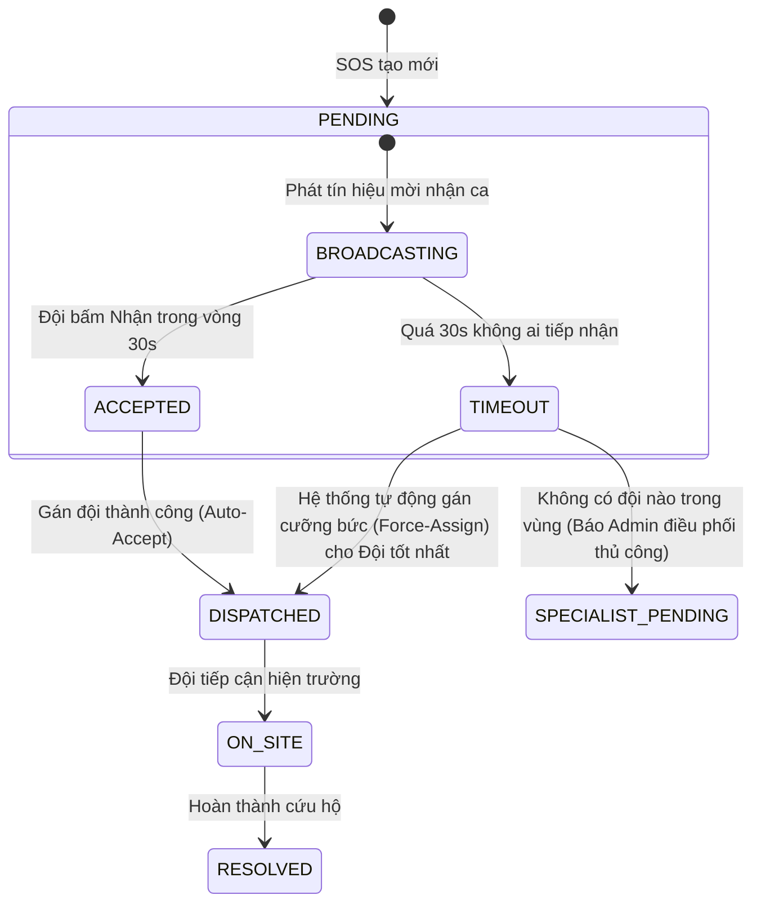

# Chiến Lược Điều Phối Cứu Hộ Tối Ưu: Mô Hình Điều Phối Lai (Hybrid Dispatch Strategy)

Tài liệu này trình bày phân tích chuyên sâu về các chiến lược điều phối (dispatch) đội cứu hộ trong hệ thống ứng phó khẩn cấp thiên tai và tai nạn. Dựa trên phân tích ưu nhược điểm của từng phương án và yêu cầu nghiệp vụ thực tế, tài liệu đề xuất giải pháp kiến trúc tối ưu: **Mô hình điều phối lai (Hybrid Dispatch)** để áp dụng cho hệ thống.

---

## 1. So Sánh 3 Chiến Lược Điều Phối Đội Cứu Hộ

Trong ngành phát triển phần mềm định vị và điều vận (Logistics/Ride-hailing/Emergency Dispatch), có 3 mô hình điều phối chính:

### Mô Hình A: Chỉ Định Cưỡng Bức (Auto-Assign)
Hệ thống tự động chạy thuật toán tìm ra đội cứu hộ tối ưu nhất và gán thẳng nhiệm vụ cho đội đó mà không cần sự đồng ý của họ.

*   **Bối cảnh áp dụng:** Lực lượng cứu hộ chính quy, quân đội, PCCC nhà nước (`114`, `115`, `112`), nơi lệnh điều phối có tính chất mệnh lệnh bắt buộc.
*   **Ưu điểm:**
    *   **Tốc độ xử lý cực nhanh (Zero-latency dispatch):** Không mất thời gian chờ con người phản hồi. Tiết kiệm tối đa thời gian vàng (Golden Hour) để cứu mạng nạn nhân.
    *   **Đảm bảo tính thực thi:** Chắc chắn ca SOS sẽ được gán cho một đội cứu hộ có năng lực tốt nhất theo tính toán của máy tính.
*   **Nhược điểm:**
    *   **Thiếu linh hoạt:** Nếu đội được gán đang gặp sự cố đột xuất ngoài đời thực (hỏng xe, thiếu nhân sự trực, hết nhiên liệu...) nhưng chưa kịp cập nhật trạng thái trên hệ thống, ca SOS sẽ bị kẹt hoặc đội đó phải đi làm nhiệm vụ trong tình trạng không đảm bảo an toàn.

---

### Mô Hình B: Tự Nguyện Tiếp Nhận (Claim/Accept-based)
Hệ thống phát thông báo cảnh báo SOS kèm nút "Nhận cứu hộ" tới các đội cứu hộ ở gần. Đội trưởng nào nhấn nút trước tiên sẽ được hệ thống gán việc chính thức (`First-come, First-served`).

*   **Bối cảnh áp dụng:** Các mạng lưới cứu hộ tình nguyện, tổ chức phi chính phủ (NGO), đội hiệp sĩ đường phố, câu lạc bộ xuồng hơi, xe bán tải cứu trợ lũ lụt...
*   **Ưu điểm:**
    *   **Độ sẵn sàng cao:** Đội cứu hộ chỉ nhận ca khi họ thực sự có khả năng thực hiện tại thời điểm đó (đầy đủ quân số, phương tiện sẵn sàng).
    *   **Tối ưu hóa nguồn lực tự nguyện:** Không tạo áp lực bắt buộc lên các đơn vị làm việc phi lợi nhuận.
*   **Nhược điểm:**
    *   **Có độ trễ lớn (High Latency):** Phải chờ đợi đội trưởng đọc thông báo và bấm nút.
    *   **Rủi ro bỏ sót:** Trong điều kiện đêm tối hoặc bão lũ ngắt quãng kết nối, nếu không ai bấm nhận, yêu cầu SOS sẽ bị bỏ trôi và nạn nhân gặp nguy hiểm nếu không có cơ chế leo thang (escalation).

---

### Mô Hình C: Điều Phối Lai (Hybrid Dispatch) — ĐỀ XUẤT TỐI ƯU
Mô hình kết hợp hai giai đoạn, tận dụng tính chủ động của mô hình tự nguyện và tính bảo đảm của mô hình cưỡng bức.

```
[SOS tạo mới] ──► [Bước 1: Mời 3 đội gần nhất nhận việc (Đợi 30s)]
                         │
                         ├─► Có đội nhận ──► [Gán việc thành công & kết thúc]
                         │
                         └─► Hết 30s không ai nhận ──► [Bước 2: Gán cưỡng bức cho đội tối ưu nhất / Báo Admin]
```

*   **Bối cảnh áp dụng:** Các hệ thống Grab/Uber điều xe, hoặc các hệ thống cứu trợ hiện đại kết hợp cả lực lượng chuyên nghiệp và tình nguyện viên.
*   **Ưu điểm:**
    *   **Cân bằng hoàn hảo:** Vừa tôn trọng tính sẵn sàng thực tế của các đội (thông qua bước xác nhận tự nguyện), vừa bảo đảm 100% ca SOS đều có đội tiếp nhận cứu hộ (thông qua bước gán cưỡng bức/báo động hành chính).
    *   **Hạn chế kẹt ca:** Giảm thiểu tối đa tình trạng gán nhầm đội bận hoặc đội gặp sự cố ngầm.
*   **Nhược điểm:**
    *   Độ phức tạp lập trình cao hơn (cần quản lý trạng thái đếm ngược, xử lý bất đồng bộ tranh chấp và hẹn giờ hủy/nâng cấp sự kiện).

---

## 2. Thiết Kế Nghiệp Vụ Mô Hình Điều Phối Lai (Hybrid Dispatch Workflow)

Khi áp dụng mô hình lai cho hệ thống cứu nạn thiên tai, quy trình nghiệp vụ chi tiết sẽ chạy qua các trạng thái sau:



### Bước 1: Giai đoạn "Lời mời tranh quyền tiếp nhận" (0 - 30 giây)
1.  Người dân gửi SOS thành công.
2.  Server chạy thuật toán tìm ra **Top 3 Đội cứu hộ tối ưu nhất** trong khu vực lân cận dựa vào khoảng cách địa lý (PostGIS) và độ lệch chuyên môn (Skill Mismatch).
3.  Server gửi một WebSocket event `sos:offer` riêng tới 3 đội này. Trên App/Màn hình của họ hiện cửa sổ Popup thông tin vụ việc và đếm ngược **30 giây**.
4.  **Trường hợp 1:** Một đội trưởng bấm nút **"Xác nhận đi cứu hộ"**:
    *   Server chạy Transaction với `pessimistic_write` lock để gán đội đó vào SOS, chuyển trạng thái SOS sang `DISPATCHED`.
    *   Hệ thống lập tức gửi sự kiện `sos:offer-claimed` tới 2 đội còn lại để tự động ẩn Popup đếm ngược trên máy họ.
5.  **Trường hợp 2:** Hết 30 giây nhưng không có ai phản hồi.

### Bước 2: Giai đoạn "Gán cưỡng bức & Leo thang" (Sau 30 giây)
Nếu bộ đếm thời gian (Timer) kích hoạt sự kiện hết giờ (Timeout):
1.  Hệ thống kiểm tra lại trạng thái SOS trong DB.
2.  Nếu vẫn là `PENDING` (chưa có đội nhận), hệ thống tự động:
    *   Chọn đội đứng vị trí số 1 (Đội tối ưu nhất) và chuyển trạng thái SOS sang `DISPATCHED` (gán cưỡng bức, phát lệnh bắt buộc di chuyển).
    *   **Hoặc:** Phát tín hiệu còi báo động đỏ `sos:no-team-available` về Trung tâm điều hành (Dashboard của Admin tỉnh) yêu cầu Admin can thiệp, gọi điện điều động trực tiếp bằng nghiệp vụ ngoài đời.

---

## 3. Kiến Trúc Lập Trình Backend (NestJS + TypeORM + Redis)

Để triển khai mô hình lai này hoạt động nhẹ nhàng và chịu tải tốt, chúng ta phối hợp 3 công nghệ chính:

1.  **PostgreSQL/PostGIS:** Tìm nhanh 3 đội ở gần bằng hàm [findAvailableTeamsInRadius](file:///d:/DoAn/DOAN/be/src/modules/rescue-team/infrastructure/persistence/repositories/rescue-team.repository.ts#L120).
2.  **Redis hoặc NestJS Timeout:** Đặt hẹn giờ đếm ngược 30 giây bất đồng bộ mà không block thread.
3.  **TypeORM Transaction Lock:** Bảo vệ tránh tranh chấp khi nhiều đội bấm nút cùng lúc.

### Cú pháp xử lý Nhận việc (Claim) chống tranh chấp dữ liệu:
```typescript
import { Injectable, BadRequestException } from '@nestjs/common';
import { DataSource } from 'typeorm';

@Injectable()
export class SosClaimService {
  constructor(private readonly dataSource: DataSource) {}

  async acceptSosOffer(sosId: number, teamId: number, userId: number) {
    return await this.dataSource.transaction(async (manager) => {
      
      // 1. SELECT FOR UPDATE: Khóa dòng SOS để ngăn chặn luồng khác sửa đổi cùng lúc
      const sos = await manager.findOne(SosRequestEntity, {
        where: { id: sosId },
        lock: { mode: 'pessimistic_write' }
      });

      if (!sos) {
        throw new BadRequestException('Yêu cầu cứu hộ không tồn tại.');
      }

      // 2. Kiểm tra xem đã có đội nào nhận trước đó chưa (Chống Race Condition)
      if (sos.status !== SosStatus.PENDING) {
        throw new BadRequestException('Yêu cầu này đã được tiếp nhận bởi đội khác.');
      }

      // 3. Khóa dòng dữ liệu của Đội cứu hộ để tránh việc đội nhận 2 ca cùng lúc
      const team = await manager.findOne(RescueTeamEntity, {
        where: { id: teamId },
        lock: { mode: 'pessimistic_write' }
      });

      if (!team || team.status !== TeamStatus.AVAILABLE) {
        throw new BadRequestException('Đội cứu hộ hiện không sẵn sàng làm nhiệm vụ.');
      }

      // 4. Tiến hành gán đội và đổi trạng thái
      sos.assignedTeamId = team.id;
      sos.status = SosStatus.DISPATCHED;
      sos.assignedAt = new Date();
      sos.assignedBy = userId;
      sos.dispatchMethod = DispatchMethod.AUTO;
      await manager.save(SosRequestEntity, sos);

      // 5. Cập nhật trạng thái của Đội cứu hộ sang bận làm nhiệm vụ
      team.status = TeamStatus.DISPATCHED;
      team.activeCasesCount = (team.activeCasesCount || 0) + 1;
      await manager.save(RescueTeamEntity, team);

      return { success: true, message: 'Bạn đã tiếp nhận yêu cầu cứu hộ thành công!' };
    });
  }
}
```

---

## 4. Đề Xuất Cho Dự Án Hiện Tại Của Bạn

1.  **Nếu muốn chạy thử nghiệm nhanh (Giai đoạn Prototype/Test):**
    Hãy giữ nguyên cơ chế **Auto-Assign (Server tự gán)** hiện tại, vì nó đơn giản nhất, ít phát sinh lỗi liên quan đến quản lý thời gian đếm ngược (Timer) và dễ dàng kiểm thử các chức năng bản đồ của bạn.
2.  **Khi nâng cấp hệ thống đi làm thực tế:**
    Nên triển khai **Mô hình điều phối lai (Hybrid Dispatch)** vì nó thực tế nhất với mô hình cứu hộ thiên tai (nơi có sự đan xen giữa lực lượng cứu hộ chuyên nghiệp và đội thiện nguyện của người dân).

---

## 5. Các Cơ Chế Transaction, Fallback, Queue & Retry Hiện Tại Trong Hệ Thống

Để bạn tự tin làm chủ và phát triển dự án này đi làm thực tế, dưới đây là phân tích chi tiết về các giải pháp bảo vệ dữ liệu và chịu lỗi (fault-tolerance) đã được lập trình sẵn trong mã nguồn backend của bạn tại [DispatchOrchestratorService](file:///d:/DoAn/DOAN/be/src/modules/sos-request/application/services/dispatch-orchestrator.service.ts):

### A. Cơ Chế Transaction & Pessimistic Lock (Bảo vệ dữ liệu tuyệt đối)
Khi điều phối tự động hoặc bàn giao ca cứu hộ, hệ thống bắt buộc phải thực hiện các hành động đọc-kiểm tra-ghi đè đồng bộ.
*   **Transaction cô lập:** Toàn bộ quá trình gán đội và đổi trạng thái được bọc trong `this.dataSource.transaction(async (manager) => { ... })`. Nếu bất kỳ bước nào bị lỗi (ví dụ: mất kết nối DB giữa chừng), toàn bộ các thay đổi sẽ tự động phục hồi (Rollback) về trạng thái ban đầu, tránh sai lệch dữ liệu.
*   **Pessimistic Write Lock (`FOR UPDATE`):** Hệ thống gọi hàm `lockTeamForUpdate` để khóa dòng dữ liệu của đội cứu hộ được chọn. Không cho phép luồng chạy song song nào đọc hay chỉnh sửa trạng thái đội đó cho đến khi transaction hiện tại kết thúc.

---

### B. 3 Cấp Độ Fallback & Queueing (Chế độ tự cứu và xếp hàng chờ)
Khi có cuộc gọi SOS mới, hệ thống không bao giờ bỏ rơi yêu cầu đó mà tự động chuyển đổi qua các cấp độ xử lý (Fallback Levels) tùy thuộc vào tình trạng sẵn sàng của lực lượng cứu hộ:

#### 1. Cấp độ 1: Gán việc trực tiếp (Direct Dispatch)
*   **Điều kiện:** Tìm thấy đội rảnh (`AVAILABLE` hoặc `STANDBY`) trong bán kính quét phù hợp.
*   **Hành động:** Gán trực tiếp đội cứu hộ đó cho ca SOS. Trạng thái SOS chuyển sang `DISPATCHED`.

#### 2. Cấp độ 2: Xếp hàng chờ việc (Queueing Fallback)
*   **Điều kiện:** Tìm thấy các đội phù hợp nhưng **tất cả các đội đó đều đang bận làm nhiệm vụ khác** (trạng thái là `DISPATCHED` hoặc `BUSY`).
*   **Hành động:** Hệ thống không báo lỗi. Nó tự động tạo một bản ghi hàng chờ trong bảng `dispatch_queue` liên kết ca SOS này với đội bận có điểm số tốt nhất kèm theo độ ưu tiên (`priorityScore`) tính toán theo mức độ khẩn cấp (Severity: CRITICAL=100, HIGH=50, MEDIUM=20...). Trạng thái SOS vẫn là `PENDING`.

#### 3. Cấp độ 3: Chờ chuyên môn đặc thù (Specialist Pending Fallback)
*   **Điều kiện:** Quét qua tất cả các bước bán kính địa lý nhưng **hoàn toàn không tìm thấy bất kỳ đội nào khả dụng** (ví dụ: ca SOS ở quá xa hoặc cần thiết bị đặc thù mà không đội nào đáp ứng).
*   **Hành động:** Hệ thống tự động chuyển trạng thái SOS sang `PENDING_SPECIALIST`, đánh dấu `specialistPending = true`, ghi nhận lịch sử và kích hoạt còi báo động đỏ phát tin nhắn cảnh báo (`alertNoTeamAvailable`) về Dashboard cho Admin để chuyển sang chế độ điều phối thủ công bằng liên lạc mặt đất.

---

### C. Cơ Chế Atomic Handoff (Bàn giao ca tự động)
Hàng chờ cứu nạn (Queue) sẽ được tự động giải quyết thông qua cơ chế giải phóng đội cứu hộ [releaseTeamAndResolveQueue](file:///d:/DoAn/DOAN/be/src/modules/sos-request/application/services/dispatch-orchestrator.service.ts#L305):
*   Khi một đội cứu hộ hoàn thành nhiệm vụ (SOS chuyển sang `RESOLVED`):
    1.  Hệ thống khóa dòng đội cứu hộ đó (`lockTeamForUpdate`).
    2.  Truy vấn bảng `dispatch_queue` bằng cú pháp nâng cao `SKIP LOCKED` để tìm ca SOS tiếp theo đang xếp hàng chờ đội này.
    3.  **Nếu có hàng chờ:** Gán ngay ca SOS mới đó cho đội cứu hộ mà không giải phóng đội về trạng thái rảnh rỗi. Đội cứu hộ tiếp tục lên đường làm nhiệm vụ mới.
    4.  **Nếu không còn hàng chờ:** Giải phóng đội cứu hộ về trạng thái sẵn sàng (`AVAILABLE`).

---

### D. Cơ Chế Tự Động Thử Lại (Auto-Dispatch Retry Loop)
Với những ca SOS bị đưa vào hàng chờ hoặc chưa tìm được đội ở thời điểm ban đầu:
*   Tiến trình ngầm [DispatchRetryService](file:///d:/DoAn/DOAN/be/src/modules/sos-request/application/services/dispatch-retry.service.ts) liên tục quét qua cơ sở dữ liệu **15 giây một lần**.
*   Nó sẽ nhặt các yêu cầu SOS chưa được gán và thử kích hoạt lại bộ máy điều phối tự động. Ngay khi có bất kỳ đội cứu hộ nào ở gần được giải phóng về trạng thái rảnh rỗi, hệ thống sẽ gán ngay lập tức cho họ.

---

## 6. Tích Hợp TomTom Traffic API & Tránh Vùng Ngập Lụt Thời Gian Thực (Real-time Routing & Traffic Integration)

Để tối ưu hóa thời gian cứu hộ thực tế trong các tình huống thiên tai phức tạp (ví dụ: bão lũ gây ngập nhiều tuyến đường, ùn tắc giao thông do mưa lớn), thuật toán điều phối tự động (Auto-Dispatch) đã được nâng cấp tích hợp dữ liệu định tuyến tránh ngập lụt của công cụ chỉ đường chính (mặc định là **OpenRouteService - ORS**) kết hợp với dữ liệu giao thông thời gian thực từ **TomTom Traffic API**.

### A. Quy Trình Định Tuyến & Xử Lý Giao Thông 2 Giai Đoạn

Do dữ liệu vùng ngập lụt được số hóa độc quyền trên bản đồ hệ thống nội bộ nhưng TomTom API không hỗ trợ nhận tham số tránh đa giác (`avoid_polygons`), thuật toán điều phối áp dụng giải pháp định tuyến lai hai giai đoạn (Hybrid Routing):

1. **Giai đoạn 1: Chỉ đường tránh ngập lụt lý tưởng (ORS Routing)**
   * Khi kích hoạt điều phối, hệ thống truy vấn các đa giác vùng ngập lụt hiện hoạt của tỉnh xảy ra sự cố từ `FloodZoneEntity` trong cơ sở dữ liệu.
   * Gọi công cụ định tuyến chính (ORS) với tham số `avoid_polygons` là các vùng ngập này để tính toán tuyến đường bộ an toàn đi vòng qua các vùng ngập.
   * Lấy kết quả thời gian di chuyển làm chuẩn lý tưởng không có traffic: `etaIdealMinutes` (Ideal ETA).

2. **Giai đoạn 2: Ước lượng độ trễ giao thông thực tế (TomTom Traffic)**
   * Hệ thống sắp xếp sơ bộ các ứng viên cứu hộ theo khoảng cách địa lý và lọc ra **Top N ứng viên tối ưu nhất** (cấu hình qua biến môi trường `TOMTOM_MAX_CANDIDATES`, mặc định là 3) để tránh quá tải hạn ngạch API.
   * Gọi **TomTom Traffic API** (`calculateRoute` với tham số `traffic=true`) cho tuyến đường trực tiếp giữa đội cứu hộ và hiện trường SOS để tính toán độ trễ do kẹt xe thực tế.
   * Tính toán hệ số kẹt xe thực tế (`traffic_factor`):
     $$\text{traffic\_factor} = \frac{\text{travelTimeInSeconds}}{\text{travelTimeInSeconds} - \text{trafficDelayInSeconds}}$$
   * Trộn hai dữ liệu: Áp dụng hệ số kẹt xe này lên thời gian di chuyển tránh ngập lý tưởng để ra thời gian di chuyển thực tế có tính đến kẹt xe:
     $$\text{etaRealisticMinutes} = \text{etaIdealMinutes} \times \text{traffic\_factor}$$

* **Lưu ý nghiệp vụ quan trọng**: Do sự khác biệt về tuyến đường (TomTom route không né ngập lụt, ORS route né ngập lụt), hệ số kẹt xe thu được là mức xấp xỉ tương đối của khu vực xung quanh. Hệ thống tự động ghi nhận thuộc tính ảo `trafficNote = "estimated_from_direct_route"` trả về phía Client để đảm bảo tính minh bạch cho điều phối viên.

---

### B. Giải Pháp Tối Ưu Hóa & Bảo Vệ Hạn Ngạch (Quota & Fault Tolerance)

Để đảm bảo hệ thống hoạt động ổn định trong gói API miễn phí của TomTom (2.500 lượt gọi/ngày, 5 QPS) và tránh lỗi gián đoạn hệ thống (Single Point of Failure), các cơ chế bảo vệ sau được triển khai trực tiếp trong [TomTomTrafficService](file:///d:/DoAn/DOAN/be/src/modules/routing/services/tomtom-traffic.service.ts):

#### 1. Bộ nhớ đệm tọa độ (Coordinate Caching)
* Các tọa độ điểm đầu và điểm cuối được **làm tròn đến 4 chữ số thập phân** (độ phân giải thực tế khoảng ~11 mét) trước khi làm khóa cache dạng `lat1,lng1:lat2,lng2`.
* Dữ liệu được lưu bộ đệm in-memory tạm thời với thời gian sống (TTL) tùy chỉnh (mặc định 240 giây), giúp giảm tới 80% số lượng cuộc gọi API lặp lại khi chạy chu kỳ kiểm tra điều phối.

#### 2. Giới hạn giá trị hệ số (Clamp Logic)
* Để phòng tránh các trường hợp dữ liệu giao thông bị lỗi từ API dẫn đến mẫu số âm hoặc bằng 0 (khiến hệ số tắc nghẽn tiến tới vô cùng hoặc âm), `traffic_factor` được ràng buộc nghiêm ngặt trong khoảng **`[1.0, 5.0]`**.
* Nếu giá trị tính toán nằm ngoài khoảng này, hệ thống sẽ tự động clamp và đưa về giá trị biên gần nhất (hoặc fallback về `1.0`), đồng thời ghi log cảnh báo riêng: `[TomTom API] traffic_factor clamped: out of range [1.0, 5.0] (value: X)` phục vụ công tác giám sát.

#### 3. Giám sát hạn ngạch theo múi giờ UTC (UTC Quota Monitoring)
* Lưu trữ bộ đếm lượt gọi API hàng ngày trong bộ nhớ. Bộ đếm tự động reset khi bước sang ngày UTC mới (`new Date().getUTCDate()`), khớp hoàn toàn 100% với chu kỳ reset hạn ngạch thực tế trên TomTom Developer Portal.
* Ghi nhận log cụ thể dạng `[TomTom API] Request count today: X/2500 (UTC)` cho mỗi yêu cầu và phát log cảnh báo mức `Warn` khi số lượt gọi vượt ngưỡng 2.000 để lập trình viên kịp thời theo dõi và nâng cấp gói cước khi cần thiết.

#### 4. Khả năng chịu lỗi & Chế độ tùy chọn (Optional Fallback)
* Nếu TomTom API gặp sự cố (mất kết nối mạng, rate-limit HTTP 429 hoặc hết hạn ngạch ngày), hệ thống tự động bắt lỗi riêng (`[TomTom API] traffic_factor fallback: API error / quota limit`), không làm sập tiến trình điều phối mà tự động đưa hệ số tắc nghẽn về `1.0` (chỉ sử dụng ETA lý thuyết từ ORS).
* Có thể tắt hoàn toàn tính năng này thông qua biến cấu hình môi trường `.env` (`TOMTOM_TRAFFIC_ENABLED=false`). Hệ thống sẽ chạy trơn tru với dữ liệu bản đồ ORS nguyên bản.

---

### C. Công Thức Tính Điểm Xếp Hạng 4 Trọng Số (Extended 4-Weight Scoring)

Khi tính năng giao thông TomTom được kích hoạt, hệ thống chuyển sang sử dụng công thức tính điểm mở rộng 4 thành phần để tìm ra đội cứu hộ tối ưu nhất:

$$\text{Score} = w_1 \times \text{Distance\_Norm} + w_2 \times \text{Duration\_Norm} + w_3 \times \text{Skill\_Mismatch} + w_4 \times \text{Workload\_Norm}$$

Trong đó:
* **Distance_Norm**: Khoảng cách di chuyển thực tế theo đường bộ (đã tránh ngập) được chuẩn hóa.
* **Duration_Norm**: Thời gian di chuyển thực tế có tính kẹt xe ($\text{etaRealisticMinutes}$) được chuẩn hóa.
* **Skill_Mismatch**: Mức độ không tương thích về chuyên môn/trang thiết bị của đội đối với loại hình sự cố SOS (ví dụ: cứu hộ ngập lụt cần đội có xuồng hơi).
* **Workload_Norm**: Số lượng ca cứu hộ đang xử lý của đội hiện tại trên tổng tải công việc tối đa (`activeCasesCount / maxCapacity`).
* **Các trọng số ($w_1, w_2, w_3, w_4$)**: Được cấu hình linh hoạt từ hệ thống, mặc định lần lượt là `0.3`, `0.4`, `0.2`, `0.1` nhằm ưu tiên hàng đầu cho các đội có thời gian di chuyển thực tế ngắn nhất và độ khớp chuyên môn cao nhất.


