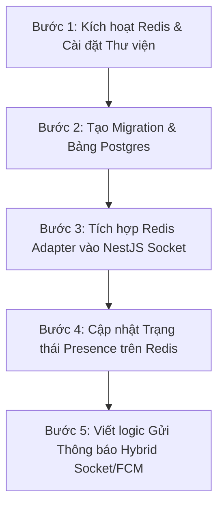

# Realtime Notification Pipeline & Presence State Management with Redis + Postgres

This document presents a comprehensive analysis of the system architecture for user status (presence) tracking and realtime notifications using a hybrid approach: **Redis** for transient socket states and **PostgreSQL** for persistent data (FCM device tokens & notification history).

---

## 1. Phân Tích & So Sánh Giải Pháp (Architectural Trade-offs)

Để xây dựng một hệ thống thông tin khẩn cấp phục vụ thiên tai, mức độ sẵn sàng (Availability) và khả năng chịu tải cao (High Write Throughput) là yếu tố sống còn. Dưới đây là so sánh giữa các phương án quản lý trạng thái online/offline và socket mapping của người dùng:

| Tiêu chí | Phương án A: Chỉ lưu RAM (In-Memory Map) | Phương án B: Lưu SQL Database (Postgres) | Phương án C (Đề xuất): Hybrid Redis + Postgres |
| :--- | :--- | :--- | :--- |
| **Kiến trúc Scale-out (Multi-server)** | ❌ **Không khả thi**. Nếu user kết nối tới Server 1 và admin kết nối tới Server 2, Server 2 không thể gửi socket tới user. | ⚠️ **Khả thi nhưng kém**. Tất cả các server query chung một DB, nhưng tạo độ trễ cao và nghẽn DB. |  **Tối ưu**. Sử dụng Redis Pub/Sub Adapter tự động sync sự kiện realtime xuyên các node. |
| **Độ trễ & Tốc độ ghi (IOPS)** |  Cực nhanh (vài micro-giây) | ❌ **Cực kỳ tệ**. Khi mạng chập chờn (vùng bão), hàng ngàn thiết bị kết nối/ngắt kết nối liên tục, Postgres sẽ bị nghẽn ghi (Write bottleneck). |  **Cực nhanh (In-memory)**. Redis HSET xử lý được hàng trăm ngàn lượt đọc/ghi mỗi giây không tốn I/O đĩa. |
| **Dọn dẹp dữ liệu rác (Stale Sockets)** | ⚠️ Phụ thuộc hoàn toàn vào tiến trình Node. Nếu server sập, RAM mất hết nhưng không đồng bộ được trạng thái thực tế. | ❌ Dữ liệu rác bám lại DB sau khi server crash, đòi hỏi cronjob định kỳ quét dọn. |  **Dọn dẹp tự động hoặc theo dõi động** thông qua TTL / Heartbeat hoặc cập nhật trực tiếp trạng thái trên Redis cực kỳ nhẹ nhàng. |
| **Lưu trữ lịch sử & Offline push** | ❌ Không hỗ trợ nếu không tích hợp DB phụ. |  Tích hợp sẵn trong DB. |  **Được phân tách hoàn hảo**. Dữ liệu động (online/offline) ở Redis; Dữ liệu tĩnh (CCCD, Token FCM, Lịch sử chat/SOS) lưu Postgres. |

### Tại sao Phương án Hybrid là Phù hợp nhất cho Cứu hộ Thiên tai?
Trong thiên tai (lũ lụt, bão), hạ tầng mạng thường xuyên chập chờn. Thiết bị của người dân và đội cứu cứu hộ thực địa sẽ liên tục Connect / Disconnect (có thể lên tới 10-20 lần/phút). 
* Nếu dùng **PostgreSQL (SQL)** để cập nhật trạng thái này, database sẽ nhanh chóng bị treo do nghẽn khóa dòng (row-level locking) và write-ahead logging (WAL).
* Bằng cách đưa dữ liệu trạng thái tạm thời sang **Redis Hash (`user:status:${userId}`)**, chúng ta giải phóng hoàn toàn Postgres khỏi tải ghi vô ích này. Postgres chỉ tập trung vào việc lưu trữ các dữ liệu mang tính cốt lõi, lâu dài như thông tin cuộc gọi cứu hộ (SOS Request), vị trí nạn nhân và lịch sử nhận tin nhắn.

---

## 2. Khó Khăn & Trở Ngại khi Triển Khai (Difficulties & Obstacles)

Trong quá trình triển khai hệ thống này, các khó khăn kỹ thuật sau cần được lường trước và xử lý tỉ mỉ:

1. **Khởi động dịch vụ Redis cục bộ**:
   * *Trở ngại*: Dịch vụ Redis trong `docker-compose.yml` hiện tại đang bị comment.
   * *Giải pháp*: Cần uncomment cấu hình Redis và chạy `docker compose up -d` để khởi động Redis Container trên cổng `6379`.
2. **Quản lý đa kết nối (Multi-device login)**:
   * *Trở ngại*: Một người dùng có thể mở web trên máy tính và cùng lúc mở ứng dụng trên điện thoại. Nếu họ ngắt kết nối trên Web, trạng thái trong Redis không được vội vã chuyển thành `offline` nếu ứng dụng điện thoại vẫn đang kết nối.
   * *Giải pháp*: Thay vì lưu trạng thái đơn giản `status: online/offline`, Hash trên Redis có thể lưu số lượng kết nối hiện tại (`connectionCount: number`), chỉ chuyển trạng thái thành `offline` khi số lượng kết nối thực tế trở về `0`.
3. **Đồng bộ hóa Redis Adapter trong NestJS**:
   * *Trở ngại*: Cần cấu hình chính xác `RedisIoAdapter` để Socket.io sử dụng Redis làm Broker trung gian. Cần quản lý vòng đời đóng/mở kết nối Redis Client để tránh rò rỉ bộ nhớ (memory leaks).
4. **Token FCM hết hạn / Trùng lặp**:
   * *Trở ngại*: Token FCM có thể bị thu hồi bởi Google/Apple khi người dùng xóa app hoặc tắt quyền thông báo.
   * *Giải pháp*: Cần handle lỗi từ FCM Service để tự động xóa/deactivate token không hợp lệ trong bảng `user_devices` tránh gửi lặp vô ích.

---

## 3. Kế Hoạch Triển Khai Chi Tiết (Implementation & Control Plan)

Chúng ta sẽ thực hiện theo kế hoạch 5 bước rõ ràng sau đây:

### Bước 1: Kích hoạt hạ tầng Redis & Cài đặt Dependencies
- [ ] Uncomment dịch vụ `redis` và volume `redis_data` trong [docker-compose.yml](file:///d:/BINH/BE/docker-compose.yml).
- [ ] Chạy lệnh `docker compose up -d redis` để khởi động Redis Container.
- [ ] Cài đặt các gói thư viện cần thiết vào backend NestJS:
  * Gói kết nối Redis: `redis` (hoặc `ioredis`)
  * Gói đồng bộ Socket.io: `@socket.io/redis-adapter`

### Bước 2: Thiết kế & Tạo các bảng PostgreSQL bằng TypeORM
- [ ] Tạo thực thể `UserDeviceEntity` (`user_devices`) để lưu FCM Token tương ứng với định dạng đề xuất.
- [ ] Tạo thực thể `NotificationEntity` (`notifications`) để lưu lịch sử thông báo phục vụ màn hình Inbox.
- [ ] Thêm các entity mới vào danh sách xuất khẩu tại `src/infrastructure/database/entities/index.ts`.
- [ ] Đồng bộ hóa database (đồng bộ tự động bằng TypeORM dev mode hoặc migration).

### Bước 3: Cấu hình Redis Adapter cho Socket.io
- [ ] Tạo file `redis-io.adapter.ts` tại thư mục chứa socket/websocket để thiết lập kết nối adapter.
- [ ] Cập nhật `main.ts` của NestJS để sử dụng `RedisIoAdapter` thay thế cho `IoAdapter` mặc định.

### Bước 4: Xử lý logic kết nối (Connection) & Ngắt kết nối (Disconnect)
- [ ] Cập nhật `NotificationGateway`:
  - [ ] Khi connect (`handleConnection`): Giải mã JWT để lấy `userId` và thiết bị. 
  - [ ] Thực hiện lệnh `HSET user:status:${userId} status "online" device "web"..."`.
  - [ ] Cho socket join vào room `user:${userId}`.
  - [ ] Khi ngắt kết nối (`handleDisconnect`): Cập nhật trạng thái `HSET user:status:${userId} status "offline" lastActive <timestamp>`.

### Bước 5: Hoàn thiện Service gửi thông báo (Hybrid Notification Service)
- [ ] Cập nhật `NotificationSocketService`:
  - [ ] Khi gọi hàm gửi thông báo đến user:
    1. Gửi tin qua Socket.io: `this.server.to(user:${userId}).emit('notification', payload)`.
    2. Đọc trạng thái người dùng từ Redis key `user:status:${userId}`.
    3. Nếu trạng thái là `offline` (hoặc gửi song song nếu tin khẩn): Query `user_devices` lấy token FCM tương ứng và kích hoạt đẩy tin qua FCM Service.
    4. Lưu thông tin tin nhắn vào bảng `notifications` để lưu trữ lịch sử xem lại.

---

## 4. Kế Hoạch Xác Minh (Verification Plan)

### Kiểm thử tự động (Automated Tests)
- [ ] Viết unit test cho `NotificationSocketService` giả lập các kịch bản người dùng Online (nhận socket) và Offline (nhận FCM).
- [ ] Chạy bộ kiểm thử: `npm run test`

### Kiểm thử thủ công (Manual Verification)
1. **Kiểm tra Redis State**: Kết nối và ngắt kết nối client, dùng `redis-cli HGETALL user:status:<userId>` để xác nhận trạng thái chuyển dịch chính xác từ `online` sang `offline` kèm thời gian hoạt động cuối cùng.
2. **Kiểm tra Postgres Storage**: Gửi tin nhắn và xác nhận bản ghi lịch sử xuất hiện trong bảng `notifications`.
3. **Kiểm tra Realtime Sync**: Chạy thử 2 terminal instances của server cùng trỏ về 1 Redis, bắn thông báo từ server 1 đến client kết nối ở server 2 để kiểm thử Redis Adapter.
