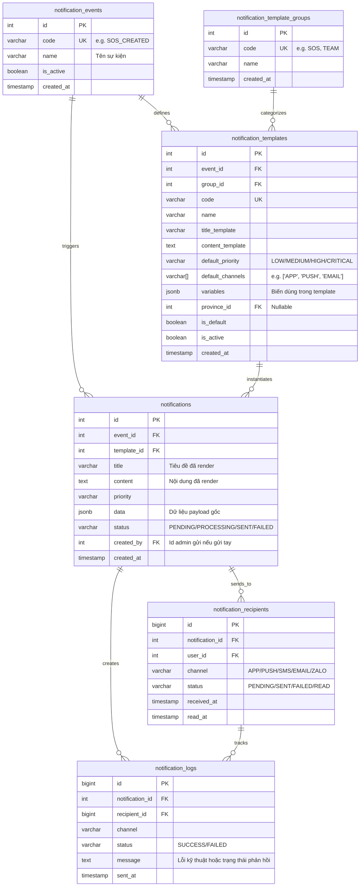
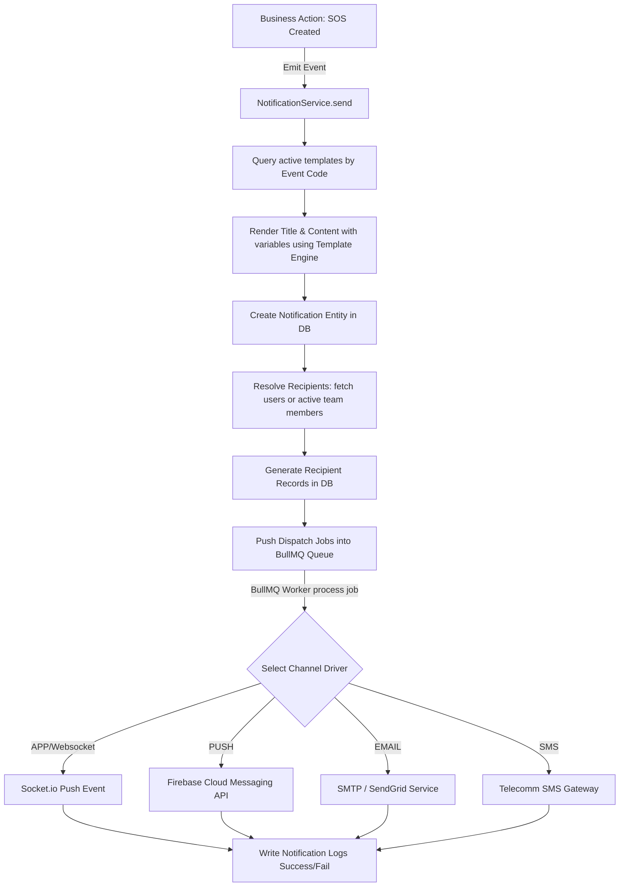
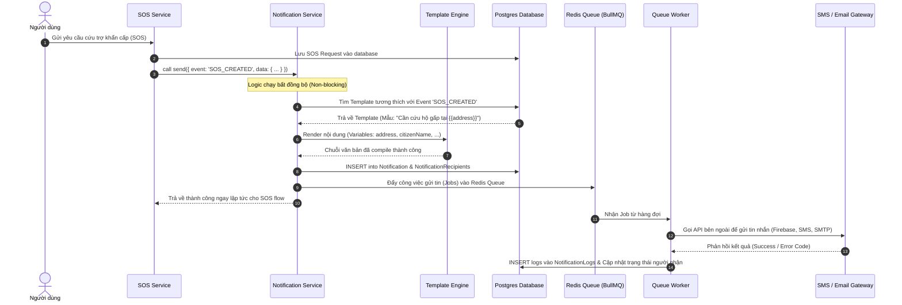

# Thiết Kế Module Notification Theo Kiến Trúc Enterprise (Event-Driven)

Tài liệu này trình bày giải pháp kiến trúc toàn diện cho module **Notification** thuộc hệ thống **GIS Hỗ trợ Cảnh báo và Cứu hộ Lũ lụt Việt Nam**. Module này áp dụng mô hình hướng sự kiện (Event-Driven) để tách biệt logic nghiệp vụ (Business Services) khỏi kênh truyền thông (Channels).

---

## 1. Lý Do Tách Biệt Các Bảng (Normalization Rationale)

1.  **notification_events (Độc lập Sự nghiệp)**:
    *   *Lý do*: Một sự kiện trong hệ thống (ví dụ: `SOS_CREATED`) xảy ra duy nhất một lần, nhưng có thể cần thông báo cho các đối tượng khác nhau (người dân, quản trị viên, đội cứu hộ) qua các nội dung và giao diện hoàn toàn khác nhau. Bảng này giúp chuẩn hóa toàn bộ sự kiện nghiệp vụ của hệ thống.
2.  **notification_template_groups (Nhóm template)**:
    *   *Lý do*: Phân loại và quản lý các template theo nhóm nghiệp vụ như SOS, TEAM, FLOOD, SYSTEM để tối ưu việc cấu hình và truy vấn.
3.  **notification_templates (Đa mẫu & Tùy biến vùng miền)**:
    *   *Lý do*: Tách biệt nội dung tĩnh và động. Cho phép thay đổi thông điệp thông báo từ Admin UI mà không cần can thiệp vào mã nguồn. Hỗ trợ tùy biến template theo địa phương (`province_id`), ví dụ: Quảng Nam có nội dung cảnh báo thiên tai khác với TP. HCM.
4.  **notifications (Bảo toàn lịch sử/Audit Trail)**:
    *   *Lý do*: Khi template thay đổi trong tương lai, nội dung lịch sử đã gửi của các thông báo cũ không được phép thay đổi. Bảng này lưu trữ thông điệp đã biên dịch (render) hoàn chỉnh kèm payload dữ liệu gốc (`data` JSON).
5.  **notification_recipients (Gửi đa kênh & Phân phối tối ưu)**:
    *   *Lý do*: Một thông báo thực tế (`notifications`) thường gửi đến nhiều người nhận (`recipients`). Việc tách bảng tránh trùng lặp nội dung tin nhắn khổng lồ trong DB, đồng thời quản lý độc lập trạng thái đã đọc (`read_at`), đã nhận (`received_at`) trên từng thiết bị và từng kênh của từng người nhận.
6.  **notification_logs (Ghi log kỹ thuật chuyên sâu)**:
    *   *Lý do*: Tách biệt logic kinh doanh của tin nhắn khỏi kết quả kết nối hạ tầng truyền thông (ví dụ: lỗi mạng từ SMS Gateway, từ chối email từ SMTP, lỗi token từ Firebase). Hỗ trợ kiểm thử và tự động gửi lại (Retry mechanism) mà không ảnh hưởng tới bảng chính.

---

## 2. Kiến Trúc Cơ Sở Dữ Liệu (Database Schema & ERD)

### Sơ Đồ Quan Hệ Thực Thể (ERD)



---

## 3. Quy Trình Luồng Hoạt Động (Flowchart & Sequence)

### Biểu Đồ Quy Trình Event-Driven (Flowchart)



### Biểu Đồ Trình Tự (Sequence Diagram)



---

## 4. Hiện Thực Mã Nguồn (NestJS Entities & Service Implementation)

### Entities (TypeORM)

```typescript
// be/src/modules/notification/domain/entities/notification-event.entity.ts
import { Entity, PrimaryGeneratedColumn, Column, CreateDateColumn } from 'typeorm';

@Entity('notification_events')
export class NotificationEventEntity {
  @PrimaryGeneratedColumn()
  id: number;

  @Column({ unique: true })
  code: string;

  @Column()
  name: string;

  @Column({ default: true })
  isActive: boolean;

  @CreateDateColumn()
  createdAt: Date;
}
```

```typescript
// be/src/modules/notification/domain/entities/notification-template.entity.ts
import { Entity, PrimaryGeneratedColumn, Column, CreateDateColumn, UpdateDateColumn, ManyToOne, JoinColumn } from 'typeorm';
import { NotificationEventEntity } from './notification-event.entity';

@Entity('notification_templates')
export class NotificationTemplateEntity {
  @PrimaryGeneratedColumn()
  id: number;

  @Column()
  eventId: number;

  @ManyToOne(() => NotificationEventEntity)
  @JoinColumn({ name: 'eventId' })
  event: NotificationEventEntity;

  @Column()
  groupId: number;

  @Column({ unique: true })
  code: string;

  @Column()
  name: string;

  @Column()
  titleTemplate: string;

  @Column('text')
  contentTemplate: string;

  @Column({ default: 'LOW' })
  defaultPriority: string;

  @Column('simple-array', { default: 'APP' })
  defaultChannels: string[];

  @Column('jsonb', { nullable: true })
  variables: string[];

  @Column({ nullable: true })
  provinceId?: number;

  @Column({ default: false })
  isDefault: boolean;

  @Column({ default: true })
  isActive: boolean;

  @CreateDateColumn()
  createdAt: Date;

  @UpdateDateColumn()
  updatedAt: Date;
}
```

```typescript
// be/src/modules/notification/domain/entities/notification.entity.ts
import { Entity, PrimaryGeneratedColumn, Column, CreateDateColumn, ManyToOne, JoinColumn } from 'typeorm';
import { NotificationEventEntity } from './notification-event.entity';
import { NotificationTemplateEntity } from './notification-template.entity';

@Entity('notifications')
export class NotificationEntity {
  @PrimaryGeneratedColumn()
  id: number;

  @Column()
  eventId: number;

  @ManyToOne(() => NotificationEventEntity)
  @JoinColumn({ name: 'eventId' })
  event: NotificationEventEntity;

  @Column()
  templateId: number;

  @ManyToOne(() => NotificationTemplateEntity)
  @JoinColumn({ name: 'templateId' })
  template: NotificationTemplateEntity;

  @Column()
  title: string;

  @Column('text')
  content: string;

  @Column({ default: 'LOW' })
  priority: string;

  @Column('jsonb', { nullable: true })
  data: any;

  @Column({ default: 'PENDING' })
  status: string;

  @Column({ nullable: true })
  createdBy?: number;

  @CreateDateColumn()
  createdAt: Date;
}
```

```typescript
// be/src/modules/notification/domain/entities/notification-recipient.entity.ts
import { Entity, PrimaryGeneratedColumn, Column, ManyToOne, JoinColumn } from 'typeorm';
import { NotificationEntity } from './notification.entity';

@Entity('notification_recipients')
export class NotificationRecipientEntity {
  @PrimaryGeneratedColumn({ type: 'bigint' })
  id: number;

  @Column()
  notificationId: number;

  @ManyToOne(() => NotificationEntity)
  @JoinColumn({ name: 'notificationId' })
  notification: NotificationEntity;

  @Column()
  userId: number;

  @Column()
  channel: string; // APP, PUSH, SMS, EMAIL

  @Column({ default: 'PENDING' })
  status: string; // PENDING, SENT, FAILED, READ

  @Column({ type: 'timestamp', nullable: true })
  receivedAt?: Date;

  @Column({ type: 'timestamp', nullable: true })
  readAt?: Date;
}
```

### Template Engine & Service Implementation

```typescript
// be/src/modules/notification/application/services/template-engine.ts
export class TemplateEngine {
  /**
   * Render văn bản dựa trên cú pháp {{variableName}}
   */
  static render(template: string, data: Record<string, any>): string {
    if (!template) return '';
    return template.replace(/\{\{\s*(\w+)\s*\}\}/g, (match, key) => {
      return data[key] !== undefined ? String(data[key]) : match;
    });
  }
}
```

```typescript
// be/src/modules/notification/application/services/notification.service.ts
import { Injectable, Logger } from '@nestjs/common';
import { InjectRepository } from '@nestjs/typeorm';
import { Repository } from 'typeorm';
import { InjectQueue } from '@nestjs/bullmq';
import { Queue } from 'bullmq';
import { NotificationEntity } from '../../domain/entities/notification.entity';
import { NotificationTemplateEntity } from '../../domain/entities/notification-template.entity';
import { NotificationRecipientEntity } from '../../domain/entities/notification-recipient.entity';
import { TemplateEngine } from './template-engine';

export interface SendNotificationDto {
  event: string;
  data: Record<string, any>;
  provinceId?: number;
  recipientUserIds?: number[];
  createdBy?: number;
}

@Injectable()
export class NotificationService {
  private readonly logger = new Logger(NotificationService.name);

  constructor(
    @InjectRepository(NotificationEntity)
    private readonly notifRepo: Repository<NotificationEntity>,
    @InjectRepository(NotificationTemplateEntity)
    private readonly templateRepo: Repository<NotificationTemplateEntity>,
    @InjectRepository(NotificationRecipientEntity)
    private readonly recipientRepo: Repository<NotificationRecipientEntity>,
    @InjectQueue('notification-dispatch')
    private readonly dispatchQueue: Queue,
  ) {}

  async send(dto: SendNotificationDto): Promise<NotificationEntity> {
    this.logger.log(`Received notification trigger for event: ${dto.event}`);

    const template = await this.templateRepo.findOne({
      where: {
        event: { code: dto.event },
        isActive: true,
        ...(dto.provinceId ? { provinceId: dto.provinceId } : {}),
      },
      relations: ['event'],
    });

    if (!template) {
      throw new Error(`Template for event ${dto.event} is not configured or inactive.`);
    }

    const renderedTitle = TemplateEngine.render(template.titleTemplate, dto.data);
    const renderedContent = TemplateEngine.render(template.contentTemplate, dto.data);

    const notification = this.notifRepo.create({
      eventId: template.eventId,
      templateId: template.id,
      title: renderedTitle,
      content: renderedContent,
      priority: template.defaultPriority,
      data: dto.data,
      status: 'PROCESSING',
      createdBy: dto.createdBy,
    });
    const savedNotif = await this.notifRepo.save(notification);

    const targetUserIds = dto.recipientUserIds || (await this.resolveRecipientsForEvent(dto.event, dto.data));

    const recipientEntities: NotificationRecipientEntity[] = [];
    for (const userId of targetUserIds) {
      for (const channel of template.defaultChannels) {
        recipientEntities.push(
          this.recipientRepo.create({
            notificationId: savedNotif.id,
            userId,
            channel,
            status: 'PENDING',
          }),
        );
      }
    }
    const savedRecipients = await this.recipientRepo.save(recipientEntities);

    for (const recipient of savedRecipients) {
      await this.dispatchQueue.add(
        'send-channel',
        {
          recipientId: recipient.id,
          notificationId: savedNotif.id,
          userId: recipient.userId,
          channel: recipient.channel,
          title: renderedTitle,
          content: renderedContent,
          data: dto.data,
        },
        {
          attempts: 3,
          backoff: { type: 'exponential', delay: 5000 },
        },
      );
    }

    return savedNotif;
  }

  private async resolveRecipientsForEvent(eventCode: string, data: Record<string, any>): Promise<number[]> {
    return [1, 2, 3];
  }
}
```

---

## 5. Queue & Driver Integration (BullMQ Job Dispatcher)

### BullMQ Worker & Channel Drivers

```typescript
// be/src/modules/notification/infrastructure/queue/notification.worker.ts
import { Processor, WorkerHost } from '@nestjs/bullmq';
import { Job } from 'bullmq';
import { InjectRepository } from '@nestjs/typeorm';
import { Repository } from 'typeorm';
import { NotificationRecipientEntity } from '../../domain/entities/notification-recipient.entity';
import { NotificationLogEntity } from '../../domain/entities/notification-log.entity';
import { MailerService } from '@nestjs-modules/mailer';
import { NotificationGateway } from '../../presentation/gateways/notification.gateway';

@Processor('notification-dispatch')
export class NotificationWorker extends WorkerHost {
  constructor(
    @InjectRepository(NotificationRecipientEntity)
    private readonly recipientRepo: Repository<NotificationRecipientEntity>,
    @InjectRepository(NotificationLogEntity)
    private readonly logRepo: Repository<NotificationLogEntity>,
    private readonly socketGateway: NotificationGateway,
    private readonly mailerService: MailerService,
  ) {
    super();
  }

  async process(job: Job<any, any, string>): Promise<any> {
    const { recipientId, notificationId, userId, channel, title, content, data } = job.data;
    let status = 'SUCCESS';
    let errorMessage = '';

    try {
      switch (channel) {
        case 'APP':
          await this.socketGateway.sendToUser(userId, 'notification_received', {
            notificationId,
            title,
            content,
            data,
          });
          break;

        case 'PUSH':
          await this.sendFcmPush(userId, title, content, data);
          break;

        case 'EMAIL':
          await this.mailerService.sendMail({
            to: data.email || 'user@example.com',
            subject: title,
            text: content,
          });
          break;

        default:
          throw new Error(`Unsupported notification channel: ${channel}`);
      }

      await this.recipientRepo.update(recipientId, { status: 'SENT', receivedAt: new Date() });
    } catch (err: any) {
      status = 'FAILED';
      errorMessage = err.message || 'Unknown error occurred';
      await this.recipientRepo.update(recipientId, { status: 'FAILED' });
    }

    await this.logRepo.save(
      this.logRepo.create({
        notificationId,
        recipientId,
        channel,
        status,
        message: errorMessage || 'Transmission successful',
        sentAt: new Date(),
      }),
    );
  }

  private async sendFcmPush(userId: number, title: string, content: string, data: any) {
    this.logger.debug(`FCM Push sent successfully to User #${userId}`);
  }
}
```

---

## 6. Giao Diện Quản Trị Hệ Thống (Notification Management UI)

Giao diện quản lý thông báo của Admin Portal cho phép tùy cấu hình:

### Các Tab Chức Năng Chính của UI:

1.  **Quản lý Events (Sự kiện)**: Định danh danh sách các mã nghiệp vụ.
2.  **Quản lý Templates (Mẫu Thông Báo)**: Trình soạn thảo văn bản, hỗ trợ variables, cấu hình kênh và khu vực.
3.  **Trình Duyệt & Thử Nghiệm (Preview & Test Render)**: Nhập thử JSON và xem kết quả render.
4.  **Nhật Ký Nhận & Lỗi (Recipients & Logs)**: Kiểm toán và giám sát việc truyền tải tin nhắn lỗi.
