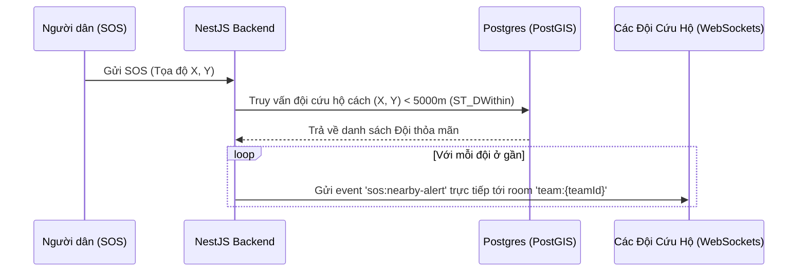
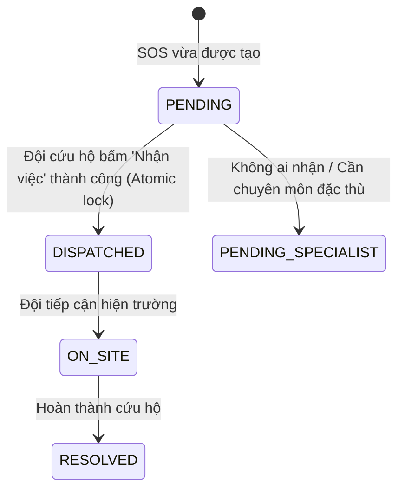

# Phân Tích & Giải Pháp Định Tuyến Sự Kiện Realtime Qua WebSockets (Radius-based Rooms & Claim System)

Chào bạn, đây là tài liệu chi tiết giải thích rõ nguyên nhân hệ thống của bạn chưa nhận được event, đồng thời hướng dẫn bạn tư duy thiết kế hệ thống **Broadcasting theo khoảng cách địa lý (bán kính 5km)** và nghiệp vụ **"Ai nhận trước được trước" (First-come, First-served)** trong thực tế đi làm.

---

## 1. Nguyên nhân Simulator của bạn không nhận được Event

Trong hệ thống của bạn hiện tại, cơ chế phân phòng (Room) của WebSocket được chia cứng theo **Tỉnh/Thành phố (`provinceId`)**:

*   **Phía Server (NestJS Gateway):**
    *   Khi client kết nối, Gateway sẽ đọc `provinceId` từ query handshake và tự động cho client join vào room `province:${provinceId}` (ví dụ: `province:28`).
    *   Khi một SOS mới được tạo hoặc cập nhật, `DispatchSocketService` chỉ phát (`emit`) sự kiện đến phòng có ID tỉnh trùng với SOS đó: `this.server.to('province:' + provinceId).emit(...)`.
*   **Phía Client (Simulator):**
    *   Lúc đầu bạn kết nối với `provinceId` mặc định trong ô cấu hình (ví dụ: `1`).
    *   Trong khi đó, 3 yêu cầu SOS (ID `7`, `8`, `9`) trong database lại có `provinceId = 6`.
    *   Sự bất đồng bộ này (`province:1` vs `province:6`) khiến client simulator hoàn toàn bị cô lập và không nhận được bất kỳ tín hiệu nào phát ra từ server. 

> [!NOTE]
> Khi chúng ta chạy cập nhật đổi tỉnh của các SOS sang `28` (TP.HCM), đồng thời tài khoản admin đăng nhập có tỉnh `28` kết nối trùng khớp, sự kiện lập tức được kích hoạt thành công trên console.

---

## 2. Giải Pháp Gửi Sự Kiện Tới Các Đội Trong Bán Kính 5km (Geospatial Room/Filtering)

Trong ứng phó khẩn cấp thiên tai, việc gửi sự kiện theo toàn bộ tỉnh (ví dụ tỉnh Thanh Hóa hay Lâm Đồng rất rộng) là **không hiệu quả**. Chúng ta cần phát tín hiệu SOS đến các đội cứu hộ ở cực ly gần (ví dụ: **bán kính 5km** quanh điểm xảy ra SOS).

Có 2 phương pháp kinh điển trong ngành GIS & WebSockets để xử lý việc này:

## 2. Giải Pháp Gửi Sự Kiện Tới Các Đội Trong Bán Kính Linh Hoạt Theo Tỉnh (Dynamic Radius & Lightweight Options)

Theo yêu cầu nghiệp vụ thực tế của bạn:
*   Phạm vi hoạt động vẫn được **giới hạn trong 1 Tỉnh/Thành phố cụ thể** để tuân thủ quyền quản lý hành chính.
*   Tuy nhiên, trong tỉnh đó, hệ thống sẽ thực hiện quét tọa độ cứu hộ từ **bán kính lân cận nhỏ (ví dụ 2km), rồi tăng dần bán kính (5km, 10km...)** tùy thuộc vào cấu hình của người dùng cho đến khi tìm thấy đội sẵn sàng.

Để đạt được mục tiêu này mà **không gây nặng tải cho hệ thống (đặc biệt là Database chính)**, chúng ta có 3 giải pháp kiến trúc phổ biến dưới đây.

---

### BẢNG SO SÁNH CÁC GIẢI PHÁP REALTIME GEOSPATIAL

| Tiêu chí | Phương án 1: PostGIS Query | Phương án 2: Redis GEO (Khuyên dùng) | Phương án 3: Admin Unit Rooms (Quận/Huyện) |
| :--- | :--- | :--- | :--- |
| **Hiệu năng hệ thống** | **Trung bình - Nặng** (Nếu ghi/đọc tọa độ liên tục vào HDD) | **Cực nhẹ** (Chạy hoàn toàn trên RAM) | **Nhẹ nhất** (Không tính toán hình học) |
| **Độ chính xác** | Chính xác tuyệt đối theo mét | Chính xác tuyệt đối theo mét | Tương đối (Theo ranh giới hành chính) |
| **Khả năng quét bán kính động** | Dễ dàng (Thay đổi tham số `R` trong SQL) | Dễ dàng (Thay đổi bán kính trong lệnh Redis) | Rất khó cấu hình tăng dần |
| **Mức độ phức tạp code** | Đơn giản (Viết SQL query) | Trung bình (Tích hợp lệnh Redis GEO) | Đơn giản (Dùng Socket.io Room) |
| **Database I/O load** | Cao (Tác động trực tiếp vào Postgres) | **Không ảnh hưởng** đến DB chính | **Không ảnh hưởng** đến DB chính |

---

### PHÂN TÍCH CHI TIẾT ƯU / NHƯỢC ĐIỂM TỪNG PHƯƠNG ÁN

### Phương án 1: Truy vấn trực tiếp PostgreSQL (PostGIS)
Server gọi truy vấn không gian (`ST_DWithin`) tới cơ sở dữ liệu Postgres để tìm các đội cứu hộ có `provinceId = X` và nằm trong bán kính `R` của điểm SOS.

*   **Ưu điểm:**
    *   **Độ chính xác cao:** Đo khoảng cách địa lý theo hệ tọa độ thực tế cực kỳ chính xác.
    *   **Dễ Code:** Tận dụng trực tiếp các hàm không gian sẵn có của PostGIS.
    *   **Bán kính động linh hoạt:** Dễ dàng chạy vòng lặp mở rộng bán kính: Quét bán kính `R = 2000` (2km) trước, nếu không có đội nào rảnh, tiếp tục chạy query với `R = 5000` (5km)...
*   **Nhược điểm (Tăng tải hệ thống):**
    *   **Nghẽn I/O Disk:** Nếu các đội cứu hộ liên tục cập nhật tọa độ GPS (ví dụ 3 giây/lần), việc lưu tọa độ mới liên tục vào ổ cứng và thực hiện tính toán khoảng cách hình học phức tạp trên CPU của Postgres sẽ khiến DB bị quá tải khi quy mô người dùng tăng lên (CPU Spike & Disk Bottleneck).
    *   *Giải pháp giảm tải:* Bắt buộc phải đánh chỉ mục Spatial Index (`CREATE INDEX ... USING GIST(location)`) để tăng tốc độ tìm kiếm.

---

### Phương án 2: Sử dụng Bộ Nhớ Đệm In-Memory (Redis GEO) — ĐỀ XUẤT CHO ĐI LÀM THỰC TẾ
Thay vì lưu tọa độ thời gian thực của các đội cứu hộ vào Postgres, ta sử dụng cấu trúc dữ liệu Geolocation tích hợp sẵn trong **Redis (RAM)**.
*   Khi Đội cứu hộ cập nhật GPS qua WebSocket, server gọi lệnh ghi tọa độ lên RAM Redis: 
    `GEOADD teams_gps:<provinceId> longitude latitude teamId`
*   Khi có SOS mới tại vị trí (X, Y) và bán kính R, server dùng lệnh tìm kiếm trên RAM Redis:
    `GEOSEARCH teams_gps:<provinceId> FROMLONLAT X Y BYRADIUS R km`

*   **Ưu điểm (Xử lý cực kỳ nhẹ và nhanh):**
    *   **Hiệu năng vượt trội:** Xử lý đọc/ghi hàng chục nghìn request/giây mà không hề tác động đến Postgres DB chính, độ trễ nhỏ hơn 1ms vì toàn bộ dữ liệu tọa độ thời gian thực nằm trên RAM.
    *   **Hỗ trợ bán kính động tuyệt vời:** Bạn chỉ cần thay đổi tham số bán kính `R` trong câu lệnh `GEOSEARCH` để quét rộng dần từ 2km lên 5km mà không cần gọi lại DB.
    *   **Chống lãng phí bộ nhớ:** Tọa độ GPS thời gian thực chỉ cần lưu tạm, không cần lưu vĩnh viễn vào ổ cứng trừ khi bạn muốn lưu vết hành trình (có thể ghi log bất đồng bộ ra file riêng hoặc DB phụ sau).
*   **Nhược điểm:**
    *   Cần cài đặt và cấu hình thêm Redis (tuy nhiên dự án hiện tại của bạn đã tích hợp sẵn Redis Adapter cho Socket.io nên việc áp dụng là cực kỳ thuận tiện).

---

### Phương án 3: Chia nhỏ các Room của Socket.io theo Quận/Huyện (Admin-unit Rooms)
Chúng ta không tính khoảng cách địa lý theo mét, mà chia nhỏ tỉnh thành các Room nhỏ hơn (ví dụ: quận/huyện).
*   Đội cứu hộ ở quận nào thì tự động join vào room: `province:<provinceId>:district:<districtId>`.
*   Khi có SOS tại quận nào, hệ thống sẽ phát tín hiệu tới room của quận đó và các quận liền kề.

*   **Ưu điểm:**
    *   **Siêu nhẹ:** Server không cần tính toán bất kỳ khoảng cách hình học nào trên CPU, Socket.io tự quản lý việc định tuyến tin nhắn qua Room.
*   **Nhược điểm:**
    *   **Thiếu chính xác:** Không phản ánh đúng khoảng cách vật lý thực tế. Một đội ở quận kề bên có thể chỉ cách điểm SOS 500m (qua một cây cầu) nhưng vì khác quận nên không nhận được tin, trong khi đội cùng quận cách xa 10km lại nhận được tin.
    *   **Khó cấu hình bán kính động:** Không thể triển khai nghiệp vụ "quét rộng dần theo bán kính hình tròn" mà người dùng yêu cầu.

---

### KẾT LUẬN CỦA SENIOR ARCHITECT:
Nếu mục tiêu của bạn là **độ chính xác cao** kèm theo **bán kính động mở rộng dần** nhưng **hệ thống xử lý nhẹ và mượt mà nhất**, bạn nên áp dụng **Phương án 2 (Redis GEO)**. Đây là cách làm thực tiễn chuẩn công nghiệp tại các công ty lớn khi xây dựng các ứng dụng định vị thời gian thực như Grab, Uber hay các hệ thống cứu hộ chuyên nghiệp.

---

### 3. Phương án A: Point-in-Radius Filtering (Gửi đích danh dựa trên PostGIS)
*(Dưới đây là mô tả kỹ thuật nếu bạn chọn cách lưu trực tiếp Postgres để triển khai nhanh)*

Thay vì dùng Room tĩnh của Socket.io, khi có SOS xảy ra, server sẽ truy vấn cơ sở dữ liệu (PostGIS) để tìm các đội ở gần, sau đó gửi trực tiếp tới socket của họ.



#### Cách triển khai ở Backend:
1.  **Đội cứu hộ khi online:** Join vào room cá nhân của đội: `team:${teamId}`.
2.  **Khi có SOS mới:**
    ```typescript
    // 1. Sử dụng hàm có sẵn findAvailableTeamsInRadius trong IRescueTeamRepository
    const nearbyTeams = await this.teamRepo.findAvailableTeamsInRadius(
      sos.latitude, 
      sos.longitude, 
      5000, // Bán kính 5km (5000 mét)
      sos.provinceId
    );

    // 2. Gửi tín hiệu trực tiếp tới Room cá nhân của từng đội nằm trong danh sách
    nearbyTeams.forEach(team => {
      this.server.to(`team:${team.id}`).emit('sos:nearby-alert', {
        sosId: sos.id,
        distance: team.distance_meters,
        // ... payload thông tin vụ việc ...
      });
    });
    ```

---

### Phương án B: Geohash Rooms (Phân vùng mạng lưới toàn cầu)
Phương án này biến bề mặt trái đất thành lưới các ô vuông nhỏ được mã hóa thành các chuỗi ký tự gọi là **Geohash**. 

*   Độ dài Geohash là **5 ký tự** tương ứng với ô vuông khoảng **4.8km x 4.8km**.
*   Độ dài Geohash là **6 ký tự** tương ứng với ô vuông khoảng **1.2km x 1.2km**.

```
+------------------+------------------+
|   Grid w3gux     |   Grid w3guy     |
|   (Đội cứu hộ A) |   (SOS xảy ra)   |
+------------------+------------------+
|   Grid w3guw     |   Grid w3guz     |
|                  |                  |
+------------------+------------------+
```

#### Cách triển khai:
1.  Mỗi khi Đội cứu hộ cập nhật GPS, backend tính ra Geohash 5 ký tự của đội (ví dụ: `w3gux`) và tự động cho socket của đội đó join vào room: `geohash:w3gux`.
2.  Khi người dân gửi SOS tại tọa độ nào đó, server tính ra Geohash của điểm SOS đó (ví dụ: `w3guy`).
3.  Server sẽ phát sự kiện tới room `geohash:w3guy` và **8 room Geohash xung quanh** nó để bao phủ trọn vẹn bán kính 5km.

> [!TIP]
> **So sánh:** Phương án A (Point-in-Radius) chính xác tuyệt đối theo mét và dễ viết code SQL PostGIS hơn. Phương án B (Geohash) lại cực kỳ tối ưu về mặt hiệu năng khi hệ thống có hàng triệu user kết nối đồng thời nhờ giảm tải truy vấn DB liên tục. Với dự án của bạn, **Phương án A** là phù hợp nhất.

---

## 3. Nghiệp Vụ "Ai Bắt Trước Thì Nhận" (First-come, First-served Claim System)

Nhiệm vụ cứu hộ khẩn cấp cần được bàn giao cho đội nào sẵn sàng phản ứng nhanh nhất. Quy trình thiết kế nghiệp vụ này gồm:

### Luồng xử lý chi tiết (Flowchart)
1.  **Phát tin:** SOS được phát đến 5 đội cứu hộ ở gần qua sự kiện `sos:nearby-alert`. Trên màn hình của 5 đội này sẽ hiển thị thông tin SOS kèm nút **"Tiếp nhận cứu hộ"**.
2.  **Nhấn nút:** Một đội trưởng nhấn nút. Client gửi event `sos:claim` kèm `{ sosId, teamId }` lên socket server.
3.  **Xử lý tranh chấp (Race Condition):** Đây là phần quan trọng nhất khi đi làm. Nếu cả 3 đội cùng nhấn nút cách nhau vài mili-giây, server phải đảm bảo **chỉ có duy nhất 1 đội được nhận**.
4.  **Phản hồi:**
    *   Đội thắng cuộc: Nhận được tin nhắn thành công. Trạng thái SOS chuyển sang `DISPATCHED`.
    *   Các đội còn lại: Nhận được tin thông báo thất bại và nút bấm trên màn hình tự động biến mất/vô hiệu hóa.



### Cách chống tranh chấp dữ liệu (Race Condition) ở Backend

Khi đi làm thực tế, bạn phải áp dụng **Pessimistic Lock (Khóa bi quan)** hoặc **Database Transaction Isolation** để ngăn chặn việc 2 đội cùng nhận 1 ca cứu hộ.

Dưới đây là đoạn mã minh họa cách xử lý tranh chấp bằng **TypeORM Transaction & pessimistic-write lock**:

```typescript
async claimSosRequest(sosId: number, teamId: number, userId: number) {
  return await this.dataSource.transaction(async (manager) => {
    
    // 1. SELECT FOR UPDATE: Khóa dòng SOS này lại, không cho transaction khác đọc/ghi đè cùng lúc
    const sos = await manager.findOne(SosRequestEntity, {
      where: { id: sosId },
      lock: { mode: 'pessimistic_write' } // <--- Chìa khóa chống tranh chấp
    });

    if (!sos) {
      throw new NotFoundException('Không tìm thấy yêu cầu cứu hộ.');
    }

    // 2. Kiểm tra xem đã có đội nào nhận trước đó chưa
    if (sos.status !== SosStatus.PENDING && sos.status !== SosStatus.PENDING_SPECIALIST) {
      throw new BadRequestException('Yêu cầu cứu hộ này đã được tiếp nhận bởi đội khác.');
    }

    // 3. Khóa dòng của Đội cứu hộ để cập nhật trạng thái hoạt động
    const team = await manager.findOne(RescueTeamEntity, {
      where: { id: teamId },
      lock: { mode: 'pessimistic_write' }
    });

    if (!team || team.status !== TeamStatus.AVAILABLE) {
      throw new BadRequestException('Đội cứu hộ hiện không sẵn sàng nhận nhiệm vụ.');
    }

    // 4. Thực hiện gán đội
    sos.assignedTeamId = team.id;
    sos.status = SosStatus.DISPATCHED;
    sos.assignedAt = new Date();
    sos.assignedBy = userId;
    await manager.save(SosRequestEntity, sos);

    // 5. Chuyển trạng thái đội sang BUSY/DISPATCHED
    team.status = TeamStatus.DISPATCHED;
    team.activeCasesCount = (team.activeCasesCount || 0) + 1;
    await manager.save(RescueTeamEntity, team);

    // 6. Phát WebSocket báo cho toàn bộ các đội khác trong khu vực gỡ nút nhận ca này đi
    this.dispatchSocketService.broadcastSosClaimed(sos.provinceId, {
      sosId: sos.id,
      assignedTeamId: team.id
    });

    return { success: true, message: 'Bạn đã tiếp nhận ca cứu hộ thành công!' };
  });
}
```

---

## 4. Kế Hoạch Đấu Nối Cho Bạn Thực Hành Ngay

Để bạn có thể kiểm chứng luồng hoạt động này, chúng ta sẽ lần lượt làm các bước sau:

*   **Bước 1:** Tái sử dụng phương thức [findAvailableTeamsInRadius](file:///d:/DoAn/DOAN/be/src/modules/rescue-team/infrastructure/persistence/repositories/rescue-team.repository.ts#L120) đã có sẵn trong repository để truy vấn các đội rảnh rỗi xung quanh vị trí SOS.
*   **Bước 2:** Bổ sung event `sos:claim` tại Gateway của Backend để xử lý luồng nhận cứu hộ chống tranh chấp.
*   **Bước 3:** Cập nhật file HTML Simulator để hiển thị nút **"Nhận cứu hộ"** khi nhận được event SOS mới ở khoảng cách gần, đồng thời cho phép nhấn nút gửi lệnh nhận việc lên Server để xem phản hồi trực quan.

---

## 5. Tối Ưu Hiệu Năng & Chống Quá Tải Traffic (Event-Driven vs Polling vs Synchronous)

Khi đi làm thực tế, việc thiết kế một API vừa có tốc độ phản hồi cực nhanh (Low Latency), vừa có thể gán việc tức thời (Realtime) mà không làm sập Database dưới áp lực hàng ngàn request đồng thời là thử thách rất lớn.

Dưới đây là phân tích chi tiết 3 mô hình xử lý điều phối để bạn nghiên cứu lựa chọn:

### A. Mô Hình Đồng Bộ Trực Tiếp (Synchronous API)
*   **Luồng đi:** Khách gửi SOS -> Server lưu DB -> Chạy thuật toán định tuyến/tìm đội -> Khóa dòng cập nhật trạng thái -> API trả về kết quả.
*   **Ưu điểm:** Điều phối tức thời ngay khi gửi thành công.
*   **Nhược điểm:**
    *   **API Response Time rất cao:** Phải chờ DB truy vấn địa lý và khóa dữ liệu rồi mới phản hồi cho client.
    *   **Nghẽn cổ chai (Connection Pool Exhaustion):** Nhiều request cùng chạy thuật toán nặng và giữ khóa DB quá lâu sẽ làm cạn kiệt kết nối DB, dẫn đến treo toàn bộ hệ thống (API Gateway Timeout).

### B. Mô Hình Quét Nền Định Kỳ (Polling Background Worker - Cơ Chế Hiện Tại)
*   **Luồng đi:** 
    1.  Khách gửi SOS -> Server lưu DB ở trạng thái `PENDING` -> Trả về kết quả ngay (mất ~1ms).
    2.  Một Worker chạy nền (`DispatchRetryService`) cứ mỗi 15 giây thức dậy quét DB và điều phối tuần tự.
*   **Ưu điểm:**
    *   **Chịu tải cực tốt:** API phản hồi siêu nhanh. Việc tìm đội nặng nhọc được gom lại và xử lý tuần tự bởi 1 tiến trình chạy nền duy nhất, không gây đột biến tải lên DB.
*   **Nhược điểm:**
    *   **Độ trễ cao (Latency):** Phải chờ từ 1 đến 15 giây để Worker thức dậy xử lý. Không tạo cảm giác realtime tức thì.

### C. Mô Hình Bất Đồng Bộ Hướng Sự Kiện (Event-Driven Asynchronous - Đề Xuất Tối Ưu)
*   **Luồng đi:**
    1.  Khách gửi SOS -> Server lưu DB ở trạng thái `PENDING`.
    2.  Server phát một sự kiện ngầm trong bộ nhớ: `eventEmitter.emit('sos.created', sosId)`.
    3.  Server trả về kết quả thành công ngay lập tức cho client.
    4.  Chạy ngầm (Event Listener): Bộ lắng nghe sự kiện bắt lấy sự kiện `sos.created`, ngay lập tức chạy thuật toán tìm đội và tự động điều phối mà **không gây nghẽn luồng API chính**.

```
[Người dân gửi SOS]
       │
       ▼ (API Controller)
1. Lưu SOS vào DB (PENDING) 
       │
       ├─► 2. Phát sự kiện ngầm: eventEmitter.emit('sos.created', { sosId })
       │
       ▼ (API Response)
3. Phản hồi thành công ngay lập tức (1ms) 
       │
       │  (Chạy ngầm / Asynchronous)
       └───────► [Event Listener: @OnEvent('sos.created')]
                       │
                       ▼ 
                 Chạy hàm dispatch() tìm đội cứu hộ gần nhất
```

#### Minh họa triển khai NestJS Event Emitter:

1. **Cài đặt thư viện:**
   ```bash
   npm i --save @nestjs/event-emitter
   ```

2. **Đăng ký module tại `app.module.ts`:**
   ```typescript
   import { EventEmitterModule } from '@nestjs/event-emitter';

   @Module({
     imports: [
       EventEmitterModule.forRoot(),
       // ... các module khác ...
     ],
   })
   export class AppModule {}
   ```

3. **Phát sự kiện tại `SosRequestService`:**
   ```typescript
   import { EventEmitter2 } from '@nestjs/event-emitter';

   @Injectable()
   export class SosRequestService {
     constructor(
       private eventEmitter: EventEmitter2,
       // ...
     ) {}

     async create(dto: CreateSosRequestDto) {
       const created = await this.sosRepo.create(sosData);

       // Phát sự kiện ngầm chạy bất đồng bộ
       this.eventEmitter.emit('sos.created', { sosId: created.id });

       return created; // Trả về kết quả ngay lập tức
     }
   }
   ```

4. **Lắng nghe và xử lý ngầm:**
   ```typescript
   import { OnEvent } from '@nestjs/event-emitter';

   @Injectable()
   export class SosDispatchListener {
     constructor(private readonly dispatchOrchestrator: DispatchOrchestratorService) {}

     @OnEvent('sos.created')
     async handleSosCreatedEvent(payload: { sosId: number }) {
       console.log(`[Event-Driven] Xử lý điều phối tự động ngầm cho SOS ID: ${payload.sosId}`);
       // Gọi bộ máy điều phối tự động ngay lập tức ngoài luồng API chính
       await this.dispatchOrchestrator.dispatchById(payload.sosId);
     }
   }
   ```

*   **Tại sao cách này vừa nhẹ vừa realtime?**
    *   **Phản hồi API lập tức:** Người dân không phải chờ.
    *   **Gán đội ngay lập tức:** Sự kiện phát ngầm chạy chỉ sau vài mili-giây, không cần chờ 15 giây.
    *   **Cách ly lỗi:** Nếu quá trình tính toán điều phối bị lỗi hoặc bị treo DB, API tạo SOS của người dân vẫn hoạt động hoàn toàn bình thường.

