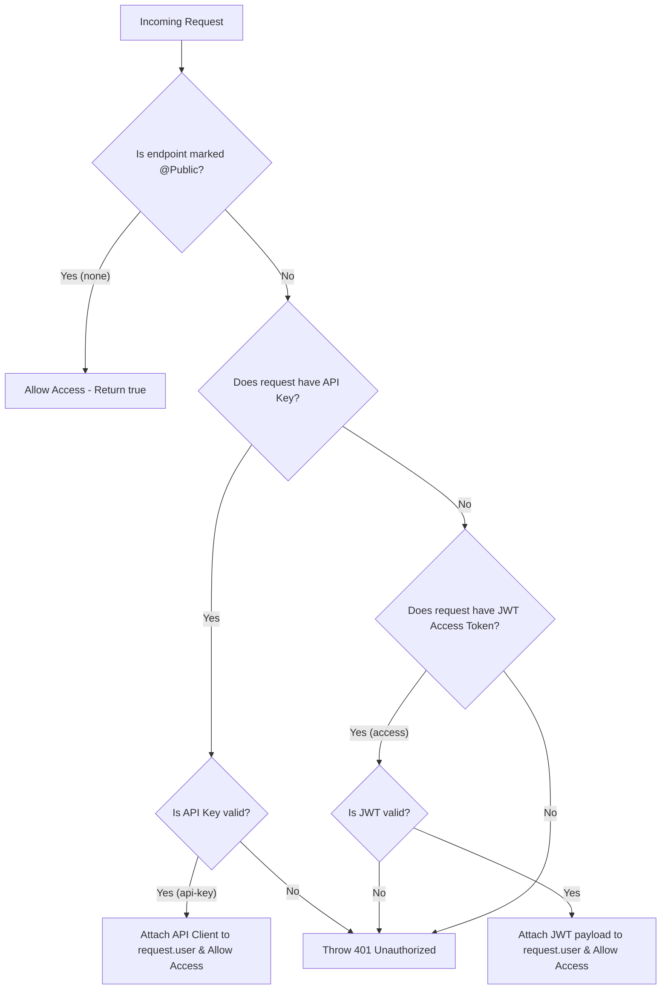

# OpenSpec: Unified Access Control Guard

## 1. Overview
In a production-ready application, endpoints require different levels of access:
1. **Public (`none`)**: Endpoints open to everyone without authentication (e.g., login, register, forgot-password, public health checks).
2. **API Key (`api-key`)**: Integration endpoints meant for system-to-system communications or specific third-party integrations, verified using a secure key.
3. **Access Token (`access`)**: Standard user endpoints protected by JWT Access Tokens, verifying the user's identity and their roles.

To achieve this, we will build a **Unified Access Guard** (`AccessGuard`) that automatically manages all three modes. By default, all routes are protected, and developers can explicitly mark routes as public using a `@Public()` decorator.

---

## 2. Architecture & Strategy

### 2.1. Flowchart of Access Control Guard


---

## 3. Components to Build

### 3.1. Public Decorator
A decorator to bypass authentication by setting metadata on controllers or specific route handlers.

- **Decorator**: `@Public()`
- **Metadata Key**: `isPublic`
- **File Location**: `be/src/infrastructure/auth/decorators/public.decorator.ts`

### 3.2. Access Service (`access.service.ts`)
A dedicated service in the Application Layer to check the validity of incoming API Keys.

- **Class**: `AccessService`
- **Method**: `validateApiKey(apiKey: string): boolean`
- **File Location**: `be/src/application/services/access.service.ts`

### 3.3. Unified Access Guard (`access.guard.ts`)
An injectable Guard registered globally in `AppModule` that extends the passport-jwt `AuthGuard('jwt')`. It processes checks in the following order:
1. **Check if public (`none`)**: If metadata `isPublic` is present and true, bypass validation.
2. **Check API Key (`api-key`)**: If `x-api-key` is supplied, validate using `AccessService`.
3. **Check Access Token (`access`)**: Fallback to Passport JWT validation.

- **Class**: `AccessGuard`
- **File Location**: `be/src/infrastructure/auth/guards/access.guard.ts`

---

## 4. Proposed Environment Configuration
We will add `API_KEY` to the `.env` file for API-key authentication:

```env
# === API Key ===
API_KEY="rescue_system_super_secret_api_key_2026"
```

---

## 5. Verification Plan

### 5.1. Manual Verification using cURL / Postman
- **Scenario 1**: Request public endpoint (e.g., `/auth/register` or `/`) -> Should return success.
- **Scenario 2**: Request protected endpoint (e.g., `/auth/admin/register` or standard protected endpoints) without any auth headers -> Should return `401 Unauthorized`.
- **Scenario 3**: Request protected endpoint with a valid `x-api-key` header -> Should return success.
- **Scenario 4**: Request protected endpoint with an invalid `x-api-key` header -> Should return `401 Unauthorized`.
- **Scenario 5**: Request protected endpoint with a valid Bearer JWT token -> Should return success.
