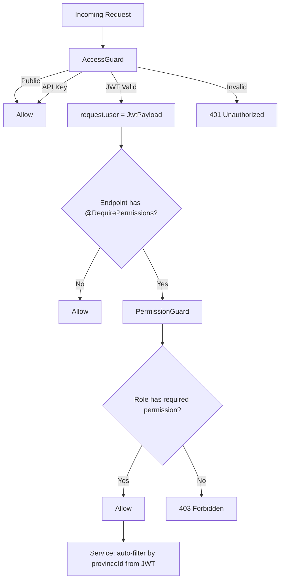

# OpenSpec: RBAC Permission Guard & Province Scope

## 1. Overview

Sau khi `AccessGuard` xác thực **ai đang gọi** (JWT / API Key / Public), hệ thống cần thêm 2 lớp bảo vệ:

1. **Permission Guard** (`@RequirePermissions()`) — kiểm tra user **có quyền cụ thể** không (RBAC).
2. **Province Scope** — đảm bảo user chỉ truy cập dữ liệu **thuộc tỉnh của mình** (multi-tenant).

Mặc định: `AccessGuard` chạy trước (xác thực) → `PermissionGuard` chạy sau (phân quyền) → Service logic (lọc theo province).

```
Request → AccessGuard (WHO are you?) → PermissionGuard (CAN you do this?) → Service (only YOUR province data)
```

---

## 2. Architecture

### 2.1. Guard Pipeline



### 2.2. Permission Check Flow (Query DB)

```
@RequirePermissions('sos:create')
         │
         ▼
PermissionGuard.canActivate()
         │
         ├─ Get roleId from request.user (set by JwtStrategy)
         ├─ Query: SELECT p.name FROM permission p
         │         JOIN role_permission rp ON p.id = rp.permissionId
         │         WHERE rp.roleId = :roleId
         │
         ├─ Compare: requiredPermissions ⊆ userPermissions?
         │     ├─ YES → return true
         │     └─ NO  → throw ForbiddenException
         │
         └─ NOTE: Future optimization — add Redis cache layer
                   (invalidate on role_permission change)
```

### 2.3. Province Scope Flow (Explicit in Service)

```
Controller method
      │
      ▼
Service method(provinceId, ...otherParams)
      │
      ├─ Get provinceId from @CurrentUser('provinceId')
      ├─ If role.level === 100 (SYSTEM_ADMIN) → no province filter
      ├─ Otherwise → WHERE province_id = :provinceId
      │
      └─ Every repository query includes provinceId filter
```

---

## 3. Components to Build

### 3.1. `@RequirePermissions()` Decorator

- **Type**: Custom Decorator (SetMetadata)
- **Metadata Key**: `permissions`
- **Usage**: `@RequirePermissions('sos:create', 'sos:read')`
- **File**: `be/src/infrastructure/auth/decorators/permissions.decorator.ts`

```typescript
import { SetMetadata } from '@nestjs/common';

export const PERMISSIONS_KEY = 'permissions';
export const RequirePermissions = (...permissions: string[]) =>
  SetMetadata(PERMISSIONS_KEY, permissions);
```

### 3.2. `PermissionGuard`

- **Class**: `PermissionGuard` implements `CanActivate`
- **File**: `be/src/infrastructure/auth/guards/permission.guard.ts`
- **Logic**:
  1. Read `permissions` metadata from handler/class via `Reflector`
  2. If no metadata → allow (endpoint doesn't require specific permissions)
  3. Get `roleId` from `request.user`
  4. Query DB for permissions of that role
  5. Check if ALL required permissions are present
  6. If not → throw `ForbiddenException`

### 3.3. `IPermissionRepository` Interface

- **File**: `be/src/domain/repositories/permission.repository.interface.ts`
- **Method**: `findPermissionNamesByRoleId(roleId: number): Promise<string[]>`

### 3.4. `PermissionRepositoryImpl`

- **File**: `be/src/infrastructure/database/repositories/permission.repository.ts`
- **Query**:
```sql
SELECT p.name
FROM permission p
JOIN role_permission rp ON p.id = rp.permissionId
WHERE rp.roleId = :roleId
```

### 3.5. Permission Sync Script (Dynamic — thay cho static JSON seed)

Thay vì seed thụ động bằng JSON file, xây dựng **1 script đồng bộ permission** chạy bằng lệnh `npm run sync:permissions`. Script đọc config, kết nối DB, và tự động upsert.

**Tại sao không dùng static JSON?**
- Static JSON: thêm module mới → phải sửa 2-3 file JSON → dễ quên → lỗi thiếu permission
- Dynamic script: sửa 1 config file → chạy 1 lệnh → tự động đồng bộ toàn bộ

**3 nguyên tắc của script:**
1. **Idempotent** — chạy nhiều lần cùng kết quả, không bao giờ duplicate
2. **Upsert** — chưa có → INSERT, đã có → UPDATE (nếu description thay đổi)
3. **Role-Permission sync** — theo config, thêm mapping mới, KHÔNG tự động xóa mapping cũ (tránh mất quyền vô tình)

#### 3.5.1. Permission Config File

- **File**: `be/src/infrastructure/database/seeds/permission-sync.config.ts`
- **Cấu trúc**: Mảng các module, mỗi module khai báo permissions + roleIds được phép

```typescript
// permission-sync.config.ts
// Format: module → permissions → roleIds được phép
// roleId tham chiếu từ bảng `role` trong DB
// Chạy: npm run sync:permissions

export const PERMISSION_CONFIG = [
  {
    module: 'sos',
    permissions: [
      {
        name: 'sos:create',
        description: 'Tạo yêu cầu SOS',
        allowedRoleIds: [1, 2, 3, 4], // SYSTEM_ADMIN, PROVINCE_ADMIN, RESCUE_TEAM_LEADER, USER
      },
      {
        name: 'sos:read',
        description: 'Xem yêu cầu SOS',
        allowedRoleIds: [1, 2, 3, 4],
      },
      {
        name: 'sos:update',
        description: 'Cập nhật SOS',
        allowedRoleIds: [1, 2, 3], // Không có USER
      },
      {
        name: 'sos:delete',
        description: 'Xóa yêu cầu SOS',
        allowedRoleIds: [1], // Chỉ SYSTEM_ADMIN
      },
    ],
  },
  {
    module: 'rescue',
    permissions: [
      {
        name: 'rescue:manage',
        description: 'Quản lý đội cứu hộ',
        allowedRoleIds: [1, 2, 3],
      },
      {
        name: 'rescue:read',
        description: 'Xem thông tin cứu hộ',
        allowedRoleIds: [1, 2, 3, 4],
      },
    ],
  },
  {
    module: 'flood',
    permissions: [
      {
        name: 'flood:create',
        description: 'Tạo báo cáo lũ',
        allowedRoleIds: [1, 2, 3, 4],
      },
      {
        name: 'flood:read',
        description: 'Xem báo cáo lũ',
        allowedRoleIds: [1, 2, 3, 4],
      },
      {
        name: 'flood:verify',
        description: 'Xác minh báo cáo lũ',
        allowedRoleIds: [1, 2],
      },
    ],
  },
  {
    module: 'disaster',
    permissions: [
      {
        name: 'disaster:manage',
        description: 'Quản lý sự kiện thiên tai',
        allowedRoleIds: [1, 2],
      },
      {
        name: 'disaster:read',
        description: 'Xem sự kiện thiên tai',
        allowedRoleIds: [1, 2, 3, 4],
      },
    ],
  },
  {
    module: 'donation',
    permissions: [
      {
        name: 'donation:manage',
        description: 'Quản lý quyên góp',
        allowedRoleIds: [1, 2],
      },
      {
        name: 'donation:read',
        description: 'Xem quyên góp',
        allowedRoleIds: [1, 2, 3, 4],
      },
    ],
  },
  {
    module: 'user',
    permissions: [
      {
        name: 'user:manage',
        description: 'Quản lý người dùng',
        allowedRoleIds: [1, 2],
      },
      {
        name: 'user:read',
        description: 'Xem thông tin người dùng',
        allowedRoleIds: [1, 2, 3],
      },
    ],
  },
  {
    module: 'report',
    permissions: [
      {
        name: 'report:read',
        description: 'Xem báo cáo thống kê',
        allowedRoleIds: [1, 2, 3],
      },
    ],
  },
  {
    module: 'alert',
    permissions: [
      {
        name: 'alert:manage',
        description: 'Quản lý cảnh báo',
        allowedRoleIds: [1, 2],
      },
      {
        name: 'alert:read',
        description: 'Xem cảnh báo',
        allowedRoleIds: [1, 2, 3, 4],
      },
    ],
  },
  {
    module: 'message',
    permissions: [
      {
        name: 'message:manage',
        description: 'Quản lý tin nhắn',
        allowedRoleIds: [1, 2, 3],
      },
      {
        name: 'message:read',
        description: 'Xem tin nhắn',
        allowedRoleIds: [1, 2, 3, 4],
      },
    ],
  },
];
```

> **Cách dùng:** Khi thêm module mới, chỉ cần thêm 1 object vào mảng `PERMISSION_CONFIG`,
> điền `allowedRoleIds` theo roleId trong DB, rồi chạy `npm run sync:permissions`.

#### 3.5.2. Permission Sync Script

- **File**: `be/scripts/sync-permissions.ts`
- **Chạy**: `npm run sync:permissions`
- **Cơ chế**:

```
1. Đọc PERMISSION_CONFIG từ permission-sync.config.ts
2. Kết nối DB (dùng TypeORM dataSource trực tiếp, không cần NestJS bootstrap)
3. Với mỗi permission trong config:
   a. SELECT từ bảng `permission` WHERE name = :name
   b. Nếu CHƯA CÓ → INSERT (name, module, description, isSystem=true)
   c. Nếu ĐÃ CÓ → UPDATE description/module (nếu thay đổi)
4. Với mỗi allowedRoleIds của permission:
   a. SELECT từ bảng `role_permission` WHERE roleId=:roleId AND permissionId=:permissionId
   b. Nếu CHƯA CÓ → INSERT mapping
   c. Nếu ĐÃ CÓ → skip
5. Log kết quả: Added X permissions, Updated Y permissions, Mapped Z role-permissions
```

- **Output ví dụ**:
```
[PermissionSync] 🔄 Syncing permissions...
[PermissionSync] ✅ Added: sos:create (module: sos)
[PermissionSync] ⏭️  Skipped (exists): sos:read
[PermissionSync] 📝 Updated description: flood:verify
[PermissionSync] ✅ Mapped: roleId=1 → sos:create
[PermissionSync] ⏭️  Skipped mapping (exists): roleId=2 → sos:read
[PermissionSync] 📊 Summary: 12 added, 3 updated, 28 mapped, 15 skipped
```

- **npm script** trong `package.json`:
```json
{
  "scripts": {
    "sync:permissions": "ts-node -r tsconfig-paths/register scripts/sync-permissions.ts"
  }
}
```

#### 3.5.3. Role-Permission Mapping Summary (tham khảo)

Config ở 3.5.1 tương đương bảng sau (roleId = thứ tự seed):

| Permission | roleId=1 (SYSTEM_ADMIN) | roleId=2 (PROVINCE_ADMIN) | roleId=3 (RESCUE_TEAM_LEADER) | roleId=4 (USER) |
|-----------|:---:|:---:|:---:|:---:|
| sos:create | ✅ | ✅ | ✅ | ✅ |
| sos:read | ✅ | ✅ | ✅ | ✅ |
| sos:update | ✅ | ✅ | ✅ | ❌ |
| sos:delete | ✅ | ❌ | ❌ | ❌ |
| rescue:manage | ✅ | ✅ | ✅ | ❌ |
| rescue:read | ✅ | ✅ | ✅ | ✅ |
| flood:create | ✅ | ✅ | ✅ | ✅ |
| flood:read | ✅ | ✅ | ✅ | ✅ |
| flood:verify | ✅ | ✅ | ❌ | ❌ |
| disaster:manage | ✅ | ✅ | ❌ | ❌ |
| disaster:read | ✅ | ✅ | ✅ | ✅ |
| donation:manage | ✅ | ✅ | ❌ | ❌ |
| donation:read | ✅ | ✅ | ✅ | ✅ |
| user:manage | ✅ | ✅ | ❌ | ❌ |
| user:read | ✅ | ✅ | ✅ | ❌ |
| report:read | ✅ | ✅ | ✅ | ❌ |
| alert:manage | ✅ | ✅ | ❌ | ❌ |
| alert:read | ✅ | ✅ | ✅ | ✅ |
| message:manage | ✅ | ✅ | ✅ | ❌ |
| message:read | ✅ | ✅ | ✅ | ✅ |

### 3.6. Update JwtStrategy

- **File**: `be/src/infrastructure/auth/strategies/jwt.strategy.ts`
- **Change**: Add `roleId` to the validated payload:
```typescript
async validate(payload: JwtPayload) {
  return {
    id: payload.sub,
    provinceId: payload.provinceId,
    roleId: payload.roleId,
  };
}
```

### 3.7. Province Scope — Explicit Pattern (No new Guard needed)

Province Scope được enforce trực tiếp trong Service layer, **không** tạo Guard/Interceptor tự động:

- Controller inject `provinceId` và `roleId` qua `@CurrentUser()`
- Service nhận `provinceId` và kiểm tra `role.level`:
  - `level === 100` (SYSTEM_ADMIN) → không filter province
  - Khác → filter `WHERE province_id = :provinceId`

**Ví dụ trong Controller:**
```typescript
@Get('sos')
async getSosRequests(
  @CurrentUser('provinceId') provinceId: number,
  @CurrentUser('roleId') roleId: number,
) {
  return this.sosService.findAll(provinceId, roleId);
}
```

**Ví dụ trong Service:**
```typescript
async findAll(provinceId: number, roleId: number) {
  const isSystemAdmin = await this.isSystemAdmin(roleId);
  return this.sosRepo.find(
    isSystemAdmin ? {} : { provinceId }
  );
}
```

---

## 4. Entities / Tables Affected

**Read:**
- `permission` — read permission names by roleId
- `role_permission` — join to get permissions
- `role` — check role level for province scope

**Write:**
- `permission` — seed new permission records
- `role_permission` — seed role-permission mappings

---

## 5. Permissions Required for This Feature

N/A — This feature IS the permission system itself.

---

## 6. Implementation Order

- [ ] 1. Create `@RequirePermissions()` decorator
- [ ] 2. Create `IPermissionRepository` interface
- [ ] 3. Create `PermissionRepositoryImpl`
- [ ] 4. Create `PermissionGuard`
- [ ] 5. Register `PermissionGuard` as APP_GUARD (after AccessGuard)
- [ ] 6. Update `JwtStrategy.validate()` to include roleId in request.user
- [ ] 7. Update `AuthModule` to provide PermissionRepository
- [ ] 8. Create `permission-sync.config.ts` (module + permission + allowedRoleIds config)
- [ ] 9. Create `scripts/sync-permissions.ts` (upsert permissions + role-permission mappings)
- [ ] 10. Add `npm run sync:permissions` to `package.json`
- [ ] 11. Apply `@RequirePermissions()` to existing `AuthController` endpoints
- [ ] 12. Document Province Scope pattern (explicit in service) with helper method
- [ ] 13. Test: run sync script, verify DB records, test permission guard, test province scope

---

## 7. Edge Cases / Special Notes

### 7.1. Permission Guard skips when no `@RequirePermissions()` is set
This means endpoints without the decorator are still protected by `AccessGuard` (must be logged in), but don't require specific permissions. This is **by design** — not every endpoint needs fine-grained permission checks.

### 7.2. SYSTEM_ADMIN bypasses Province Scope
SYSTEM_ADMIN (level 100) can see data across all provinces. This is enforced in Service logic, not in Guard.

### 7.3. API Key requests skip Permission Guard
When authenticated via API Key (system-to-system), `request.user` doesn't have `roleId`. Permission Guard should detect this and allow access (API Key is already a high-trust mechanism).

### 7.4. Future: Redis Caching for Permission Checks
Currently, every request with `@RequirePermissions()` triggers a DB query. This is fine for low-traffic scenarios. For production, add a Redis cache layer:
- **Key**: `role:{roleId}:permissions`
- **TTL**: 5 minutes
- **Invalidation**: On `role_permission` INSERT/DELETE
- **Note**: Add to Technical Debt backlog

### 7.5. Permission naming convention
Format: `{module}:{action}` (e.g., `sos:create`, `flood:verify`). This follows the **resource:action** pattern, making it easy to understand and scale.

### 7.6. Permission Sync Script is NOT a replacement for seed
The `sync:permissions` script chỉ đồng bộ bảng `permission` và `role_permission`. Việc seed `province`, `role`, `admin-users` vẫn dùng `SeederService` như cũ. Script chạy độc lập, không phụ thuộc NestJS bootstrap.

### 7.7. roleId trong config là ID thực tế từ DB
`allowedRoleIds` trong `permission-sync.config.ts` dùng roleId từ DB (1=SYSTEM_ADMIN, 2=PROVINCE_ADMIN, ...). Nếu thay đổi thứ tự seed role, phải cập nhật config tương ứng. **Lưu ý:** sau này có thể cải tiến bằng cách dùng role name thay vì roleId (cần query thêm 1 bước).

---

## 8. Technical Keywords for Self-Study

- **RBAC (Role-Based Access Control)** — phân quyền dựa trên vai trò
- **ABAC (Attribute-Based Access Control)** — phân quyền dựa trên thuộc tính (mở rộng sau)
- **NestJS Custom Decorators + SetMetadata + Reflector** — metaprogramming pattern
- **Guard Pipeline** — nhiều Guard chạy tuần tự, mỗi Guard kiểm tra 1 aspect
- **Multi-tenancy (tenant isolation)** — cô lập dữ liệu theo tenant (province)
- **Row-Level Security** — bảo mật cấp dòng dữ liệu trong DB
